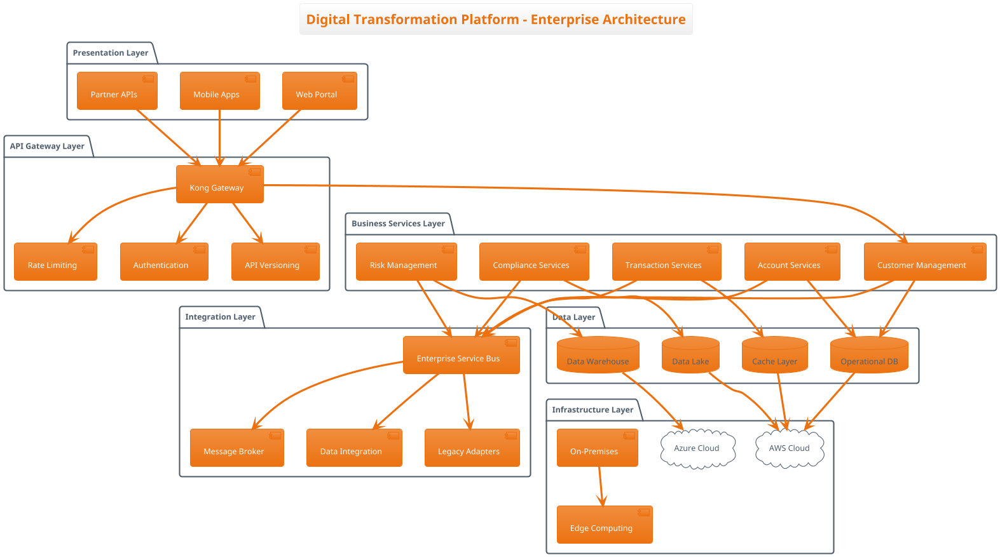

# GEMMA 4 LATEST ENTERPRISE BENCHMARK & EVALUATION PLAN
## Comprehensive Fortune 500 Deployment Assessment
*Complete Step-by-Step Implementation Guide for Gemma4:latest Model*

## OVERVIEW
**Objective:** Comprehensive evaluation of Gemma 4:latest model for enterprise-scale coding agent deployment  
**Primary Target:** Large-scale enterprise software development with optimal AI assistance  
**Expected Duration:** 6-8 hours (comprehensive enterprise testing)  
**Final Deliverable:** Complete enterprise benchmark report with performance data and deployment recommendations for server-grade infrastructure
**Model URL:** https://ollama.com/library/gemma4:latest

**Key Focus Areas:**
- **Model Assessment:** Latest Gemma 4 model capabilities and performance
- **Enterprise Readiness:** Fortune 500-scale deployment suitability
- **Comparative Analysis:** Position relative to proven 26B/31B enterprise models
- **Business Value:** ROI analysis and deployment recommendations

---

## PHASE 1: SETUP & ENVIRONMENT (Steps 1-3)

### STEP 1: Enterprise System Environment Documentation
**Commands to Execute:**
```bash
# System Hardware Specifications (Enterprise Focus)
system_profiler SPHardwareDataType

# Software Environment
system_profiler SPSoftwareDataType  

# Ollama Version and Configuration
ollama --version

# Current System Performance Baseline (Enterprise Load)
top -l 1 | head -15

# Available Disk Space (Model Requirements)
df -h

# Memory Configuration (Critical for Latest Model)
vm_stat

# Battery Status Baseline (Server/Workstation Assessment)
pmset -g batt

# CPU Configuration Details
sysctl -n hw.ncpu hw.physicalcpu hw.logicalcpu
sysctl -n hw.memsize
```
**Expected Output:** Complete enterprise system specs for Report Section 3  
**File Output:** Save to `performance_data/gemma4_latest_system_environment.txt`

### STEP 2: Gemma4:latest Model Information Collection  
**Commands to Execute:**
```bash
# Pull the latest model if not available
ollama pull gemma4:latest

# Model Configuration Details
ollama show gemma4:latest --modelfile

# Model File Size and Storage Requirements
du -sh ~/.ollama/models/blobs/* | grep -v "26b\|31b"
ollama list | grep gemma4

# Model Loading Performance Test
time ollama run gemma4:latest "Test loading performance for enterprise evaluation" > /dev/null

# Memory Usage During Model Loading
echo "Gemma4:latest Model Memory Test:"
ollama run gemma4:latest "hello" &
sleep 5
ps aux | grep ollama
pkill -f "ollama run gemma4:latest"

# Model Response Speed Baseline
time ollama run gemma4:latest "Generate a simple Spring Boot REST controller with CRUD operations" | wc -l
```
**Expected Output:** Gemma4:latest model specifications for Report Section 2  
**File Output:** Save to `performance_data/gemma4_latest_model_specifications.txt`

### STEP 3: Enterprise Baseline Performance Measurement
**Commands to Execute:**
```bash
# Memory Usage Before Model Loading (Enterprise Monitoring)
top -pid $(pgrep ollama) -l 1

# System Temperature Baseline (Server Performance)
sudo powermetrics -i 1000 -n 5 | grep -E "(CPU die temperature|GPU die temperature)"

# Network and Process Check (Enterprise Environment)
ps aux | grep ollama
netstat -an | grep LISTEN

# Disk I/O Performance (Model Loading)
iostat -c 3 5

# System Load Average Monitoring
uptime
```
**Expected Output:** Enterprise baseline metrics for comparison  
**File Output:** Save to `performance_data/gemma4_latest_baseline_performance.txt`

---

## PHASE 2: CORE CAPABILITY TESTING (Steps 4-11)

### STEP 4: Advanced Reasoning Test - Enterprise System Analysis
**Test Scenario:** Large-Scale Distributed System Failure Analysis

**Prompt for Gemma4:latest:**
```
"A large-scale enterprise distributed system serving 100 million users globally is experiencing critical failures. As a principal architect, analyze these symptoms:

SYSTEM OVERVIEW:
- 500+ microservices across 12 AWS regions
- Kubernetes clusters with 10,000+ pods
- Multi-tier architecture (API Gateway → Service Mesh → Microservices → Databases)
- Real-time data processing (Apache Kafka, 50TB/day)
- Multi-database setup (PostgreSQL clusters, MongoDB, Redis, Elasticsearch)

CURRENT SYMPTOMS:
- API Gateway showing 25% of requests failing with 504 timeouts
- Service mesh (Istio) reporting circuit breakers open across 40% of service pairs
- Database connection pools exhausted across 15 PostgreSQL clusters (max 1000 connections each)
- Kafka consumer lag growing exponentially (currently 2.5 million messages behind)
- Memory leaks detected in Java services (heap growing from 4GB to 16GB over 8 hours)
- Elasticsearch cluster showing yellow status with 30% of shards unassigned
- Redis clusters experiencing failover events every 10-15 minutes
- Load balancers reporting 503 errors for 18% of traffic
- CDN cache hit ratio dropped from 95% to 31%
- DNS resolution failures increasing (5% failure rate)

BUSINESS IMPACT:
- Revenue loss: $50,000 per minute of degraded service
- Customer complaints increasing 400%
- SLA breaches affecting enterprise contracts
- Mobile app crash rates increased 300%

INFRASTRUCTURE DETAILS:
- AWS EC2 instances: mix of c5.24xlarge, r5.16xlarge, i3.8xlarge
- EKS clusters with Cluster Autoscaler and Horizontal Pod Autoscaler
- RDS Multi-AZ deployments with read replicas
- ElastiCache clusters in cluster mode
- Application Load Balancers with WAF enabled
- CloudFront distribution with custom origin policies

Provide a comprehensive analysis including:

1. PRIMARY ROOT CAUSE IDENTIFICATION:
   - Systematic analysis methodology
   - Evidence-based reasoning for the primary cause
   - Secondary and tertiary contributing factors
   - Timeline reconstruction of the failure cascade

2. IMMEDIATE STABILIZATION PLAN (0-4 hours):
   - Critical interventions to stop the bleeding
   - Resource scaling strategies
   - Circuit breaker and rate limiting adjustments
   - Database connection management
   - Kafka consumer rebalancing

3. SHORT-TERM RESOLUTION (4-24 hours):
   - Detailed remediation steps with priorities
   - Code fixes with implementation examples
   - Infrastructure adjustments
   - Monitoring and alerting improvements
   - Rollback procedures if fixes fail

4. LONG-TERM PREVENTION (1-4 weeks):
   - Architectural improvements
   - Capacity planning enhancements
   - Chaos engineering implementation
   - Observability stack improvements
   - Team process improvements

5. ENTERPRISE MONITORING STRATEGY:
   - SLI/SLO definitions for critical services
   - Distributed tracing implementation
   - Anomaly detection systems
   - Capacity planning automation
   - Incident response automation

6. BUSINESS CONTINUITY MEASURES:
   - Disaster recovery procedures
   - Multi-region failover strategies
   - Customer communication protocols
   - Financial impact mitigation

Provide specific code examples, infrastructure configurations, and monitoring setups. Include estimated timelines, resource requirements, and risk assessments for each recommendation."
```

**Execution Commands:**
```bash
# Gemma4:latest Test
time ollama run gemma4:latest "[Full prompt above]" > technical_reports/reasoning_test_gemma4_latest_enterprise.txt
```

**Measurement Criteria:**
- Response time (minutes)
- Solution depth and enterprise applicability (1-10 scale)
- Root cause identification accuracy and methodology
- Code solution quality and production readiness
- Business impact understanding
- Scalability of recommendations

### STEP 5: Advanced Reasoning Test - Enterprise Architecture Optimization
**Test Scenario:** Global E-commerce Platform Modernization

**Prompt for Gemma4:latest:**
```
"Design a comprehensive modernization strategy for a global e-commerce platform with these enterprise requirements:

CURRENT STATE:
- Legacy monolithic architecture (10+ years old, Java/Spring)
- 200 million registered users across 50 countries
- 50,000+ products, 1,000+ sellers
- Peak traffic: 500,000 concurrent users during sales events
- Current infrastructure: On-premises data centers in 5 regions
- Technology debt: Java 8, Spring 4.x, Oracle 11g, legacy messaging

BUSINESS REQUIREMENTS:
- Handle 1 billion users within 24 months
- Support real-time inventory across 10,000+ warehouses
- Sub-100ms response times for critical user journeys
- 99.99% availability with <$5M annual infrastructure budget
- Regulatory compliance: GDPR, PCI-DSS, SOX, CCPA
- Multi-currency support for 100+ currencies
- Real-time personalization and recommendations
- Support for 50x traffic spikes during flash sales
- Integration with 200+ external partners and APIs

TECHNICAL CONSTRAINTS:
- Zero-downtime migration required
- Maintain data consistency during transition
- Support existing mobile apps (iOS/Android)
- Integration with existing ERP, CRM, and warehouse systems
- Security: End-to-end encryption, multi-factor authentication
- Performance: 95th percentile response times <200ms

Provide a comprehensive enterprise modernization plan:

1. TARGET ARCHITECTURE DESIGN:
   - Microservices decomposition strategy (identify 20-30 core services)
   - Event-driven architecture with domain boundaries
   - API gateway and service mesh topology
   - Data architecture (CQRS, event sourcing, polyglot persistence)
   - Security architecture (zero trust, API security, data encryption)
   - Multi-region deployment strategy

2. TECHNOLOGY STACK SELECTION:
   - Programming languages and frameworks
   - Database technologies (SQL, NoSQL, search, cache)
   - Message brokers and event streaming platforms
   - Container orchestration and service mesh
   - Observability and monitoring stack
   - CI/CD and DevOps toolchain
   - Cloud provider services (AWS/Azure/GCP)

3. MIGRATION STRATEGY (24-month timeline):
   - Phase 1: Foundation and core services (0-6 months)
   - Phase 2: Customer-facing services (6-12 months)
   - Phase 3: Seller and inventory services (12-18 months)
   - Phase 4: Analytics and ML services (18-24 months)
   - Detailed strangler fig pattern implementation
   - Data migration strategies with zero downtime

4. IMPLEMENTATION DETAILS:
   - Complete code examples for critical components
   - Database schema designs for microservices
   - API specifications (OpenAPI/GraphQL)
   - Kubernetes manifests and Helm charts
   - Terraform/CloudFormation infrastructure as code
   - CI/CD pipeline configurations

5. SCALABILITY AND PERFORMANCE:
   - Auto-scaling strategies (horizontal and vertical)
   - Caching architecture (multi-tier, CDN, application cache)
   - Database sharding and partitioning strategies
   - Load balancing and traffic routing
   - Performance testing and capacity planning
   - Chaos engineering implementation

6. OPERATIONAL EXCELLENCE:
   - SRE practices and error budgets
   - Incident response and on-call procedures
   - Monitoring, logging, and distributed tracing
   - Security scanning and vulnerability management
   - Cost optimization and FinOps practices
   - Team organization and Conway's law considerations

7. RISK MITIGATION:
   - Technical risks and mitigation strategies
   - Business continuity planning
   - Rollback procedures for each migration phase
   - Security and compliance validation
   - Performance regression prevention
   - Vendor lock-in avoidance strategies

8. SUCCESS METRICS AND KPIs:
   - Technical metrics (latency, throughput, availability)
   - Business metrics (conversion rate, revenue impact)
   - Operational metrics (deployment frequency, MTTR)
   - Cost metrics (infrastructure cost per transaction)
   - Team metrics (developer productivity, time to market)

Include detailed cost analysis, timeline estimates, resource requirements, and technology evaluation matrices. Provide specific implementation examples and architecture diagrams in text format."
```

**Execution Commands:**
```bash
# Gemma4:latest Test
time ollama run gemma4:latest "[Full prompt above]" > technical_reports/reasoning_test_gemma4_latest_architecture.txt
```

### STEP 6: Enterprise Agentic Workflow Test - Multi-step System Design
**Test Scenario:** Enterprise Banking Platform Development

**Sequential Prompts (Maintain Context):**

**Prompt 1 - Requirements Analysis:**
```
"You are a principal enterprise architect tasked with designing a new digital banking platform. Analyze these comprehensive requirements and create a detailed requirements specification:

BUSINESS REQUIREMENTS:
- Support 50 million customers across 25 countries
- Handle $1 trillion in annual transaction volume
- Real-time payments and cross-border transfers
- Regulatory compliance: Basel III, PCI-DSS, GDPR, PSD2, Open Banking
- Multi-channel support: web, mobile, API, branch integration
- 24/7 operations with 99.999% availability requirement

FUNCTIONAL REQUIREMENTS:
- Account management (checking, savings, investment, credit)
- Payment processing (domestic, international, instant payments)
- Loan origination and management
- Investment and wealth management
- Corporate banking services
- Risk management and fraud detection
- Customer onboarding with KYC/AML
- Reporting and analytics

NON-FUNCTIONAL REQUIREMENTS:
- Performance: <100ms for critical operations
- Security: End-to-end encryption, multi-factor authentication
- Scalability: Handle 10x growth over 5 years
- Integration: 500+ external systems and partners
- Compliance: Real-time regulatory reporting
- Disaster recovery: RTO <4 hours, RPO <15 minutes

Provide a comprehensive requirements analysis with:
1. Detailed functional decomposition
2. Non-functional requirements prioritization
3. Regulatory compliance mapping
4. Integration requirements analysis
5. Risk assessment and mitigation strategies
6. Success criteria and acceptance criteria"
```

**Prompt 2 - Architecture Design:**
```
"Based on your previous requirements analysis, design a comprehensive enterprise architecture for the digital banking platform:

1. HIGH-LEVEL ARCHITECTURE:
   - System boundaries and context diagrams
   - Microservices decomposition (identify 30-40 services)
   - Data flow and integration patterns
   - Security architecture and trust boundaries
   - Deployment architecture across multiple regions

2. DETAILED COMPONENT DESIGN:
   - Core banking services architecture
   - Payment processing engine design
   - Risk management and fraud detection systems
   - Customer onboarding and KYC workflows
   - API gateway and service mesh design
   - Data platform architecture (operational and analytical)

3. TECHNOLOGY STACK:
   - Programming languages and frameworks
   - Database technologies (transactional and analytical)
   - Message brokers and event streaming
   - Cloud services and infrastructure
   - Security and compliance tools
   - Monitoring and observability stack

Provide detailed architecture diagrams in text format, technology justifications, and integration patterns."
```

**Prompt 3 - Implementation Plan:**
```
"Create a detailed implementation plan for the digital banking platform based on your architecture design:

1. IMPLEMENTATION PHASES (36-month timeline):
   - Phase 1: Core infrastructure and foundation services (0-9 months)
   - Phase 2: Customer-facing services and basic banking (9-18 months)
   - Phase 3: Advanced services and integrations (18-27 months)
   - Phase 4: Analytics, ML, and optimization (27-36 months)

2. TECHNICAL IMPLEMENTATION:
   - Development methodology and team structure
   - CI/CD pipeline design and implementation
   - Testing strategy (unit, integration, performance, security)
   - Deployment strategy and infrastructure automation
   - Monitoring and alerting implementation
   - Security implementation and compliance validation

3. RISK MANAGEMENT:
   - Technical risk identification and mitigation
   - Regulatory compliance validation
   - Performance and scalability testing
   - Security testing and penetration testing
   - Business continuity and disaster recovery testing

Provide detailed project plans, resource estimates, and milestone definitions."
```

**Prompt 4 - Code Implementation:**
```
"Implement critical components of the digital banking platform based on your implementation plan:

1. CORE BANKING SERVICE:
   - Account management microservice
   - Transaction processing engine
   - Event sourcing implementation for audit trails
   - API endpoints for banking operations

2. PAYMENT PROCESSING:
   - Real-time payment processing service
   - International transfer handling
   - Fraud detection integration
   - Regulatory reporting automation

3. SECURITY IMPLEMENTATION:
   - Authentication and authorization service
   - API security and rate limiting
   - Data encryption and key management
   - Audit logging and compliance monitoring

Provide production-ready code with comprehensive error handling, logging, monitoring, and security features. Include unit tests and integration tests."
```

**Prompt 5 - Operations and Monitoring:**
```
"Design and implement comprehensive operations and monitoring for the digital banking platform:

1. OBSERVABILITY STACK:
   - Metrics collection and dashboards
   - Distributed tracing implementation
   - Centralized logging and analysis
   - Real-time alerting and notification

2. OPERATIONAL PROCEDURES:
   - Incident response procedures
   - Change management processes
   - Capacity planning and scaling procedures
   - Disaster recovery and business continuity
   - Security monitoring and threat detection

3. COMPLIANCE MONITORING:
   - Regulatory reporting automation
   - Audit trail maintenance and analysis
   - Compliance dashboard and KPI tracking
   - Automated compliance validation

Provide detailed operational runbooks, monitoring configurations, and compliance procedures."
```

**Execution Commands:**
```bash
# Gemma4:latest Agentic Test
time ollama run gemma4:latest "[Prompt 1]" > technical_reports/agentic_gemma4_latest_step1_enterprise.txt
time ollama run gemma4:latest "[Prompt 2]" > technical_reports/agentic_gemma4_latest_step2_enterprise.txt
time ollama run gemma4:latest "[Prompt 3]" > technical_reports/agentic_gemma4_latest_step3_enterprise.txt
time ollama run gemma4:latest "[Prompt 4]" > technical_reports/agentic_gemma4_latest_step4_enterprise.txt
time ollama run gemma4:latest "[Prompt 5]" > technical_reports/agentic_gemma4_latest_step5_enterprise.txt
```

**Measurement Criteria:**
- Context retention across complex steps (1-10 scale)
- Enterprise-level thinking and planning quality
- Code quality and production readiness
- Architecture complexity and appropriateness
- Business understanding and compliance awareness

### STEP 7: Enterprise Full-stack Development Test
**Test Scenario:** Enterprise Resource Planning (ERP) System

**Prompt for Gemma4:latest:**
```
"Act as a principal enterprise architect and lead developer. Build a comprehensive Enterprise Resource Planning (ERP) system for a multinational manufacturing company with 50,000+ employees. Execute each step methodically with enterprise-grade implementation.

BUSINESS CONTEXT:
- Manufacturing company with 200+ locations globally
- Complex supply chain with 10,000+ suppliers
- Multi-currency operations in 40+ countries
- Regulatory requirements: SOX, GDPR, country-specific regulations
- Integration with existing systems: SAP, Oracle, Salesforce, legacy mainframes

SYSTEM REQUIREMENTS:
- Multi-tenant architecture supporting different business units
- Real-time data processing and analytics
- Mobile-first design for factory workers and field personnel
- Offline capability for remote locations
- Advanced security and compliance features
- Support for 100,000+ concurrent users

STEP 1: Enterprise Data Architecture
Design a comprehensive data architecture including:
- Master data management (customers, suppliers, products, employees)
- Transactional data (orders, invoices, payments, inventory)
- Analytical data warehouse and data lake
- Real-time data streaming and processing
- Data governance and compliance
- Multi-region data replication and consistency
Provide complete database schemas, data flow diagrams, and ETL processes.

STEP 2: Microservices Architecture
Create a full microservices architecture with:
- Domain-driven design with bounded contexts
- 40+ microservices covering all ERP modules
- Event-driven architecture with saga patterns
- API gateway and service mesh (Istio)
- Service discovery and configuration management
- Circuit breakers and resilience patterns
Provide service definitions, API contracts, and integration patterns.

STEP 3: Backend Implementation (Java/Spring Boot)
Implement core ERP modules:
- Financial management (accounting, budgeting, reporting)
- Supply chain management (procurement, inventory, logistics)
- Human resources (payroll, benefits, performance)
- Customer relationship management
- Manufacturing execution system (MES)
- Business intelligence and analytics
Include comprehensive security, audit logging, and compliance features.

STEP 4: Frontend Implementation (React/Angular)
Build enterprise-grade user interfaces:
- Role-based dashboards for different user types
- Mobile-responsive design for all devices
- Real-time data visualization and analytics
- Workflow management and approval processes
- Document management and collaboration
- Multi-language and localization support
Include accessibility compliance (WCAG 2.1) and modern UX patterns.

STEP 5: Integration Layer
Implement comprehensive integration capabilities:
- Enterprise service bus (ESB) with message routing
- API management and gateway
- ETL/ELT processes for data integration
- Real-time data synchronization
- Legacy system integration adapters
- Third-party service integrations (payment, shipping, etc.)
- B2B integration (EDI, APIs, file transfers)

STEP 6: Security and Compliance
Implement enterprise security framework:
- Identity and access management (IAM)
- Single sign-on (SSO) and multi-factor authentication
- Role-based access control (RBAC) with fine-grained permissions
- Data encryption at rest and in transit
- Audit logging and compliance reporting
- Vulnerability scanning and security monitoring
- GDPR compliance with data privacy controls

STEP 7: DevOps and Infrastructure
Create comprehensive DevOps pipeline:
- Infrastructure as Code (Terraform/ARM templates)
- Container orchestration (Kubernetes)
- CI/CD pipelines with automated testing
- Blue-green deployments and canary releases
- Monitoring and observability (Prometheus, Grafana, Jaeger)
- Log aggregation and analysis (ELK stack)
- Backup and disaster recovery automation

STEP 8: Performance and Scalability
Implement performance optimization:
- Database optimization and indexing strategies
- Caching layers (Redis, CDN, application cache)
- Load balancing and auto-scaling
- Performance monitoring and APM
- Capacity planning and resource optimization
- Database sharding and read replicas
- CDN implementation for global performance

Execute each step completely with production-ready code, configurations, and documentation. Include error handling, logging, monitoring, and comprehensive testing for each component."
```

**Execution Commands:**
```bash
# Gemma4:latest Full-stack Enterprise Test
time ollama run gemma4:latest "[Full prompt above]" > technical_reports/fullstack_gemma4_latest_enterprise.txt
```

### STEP 8: Advanced Enterprise Architecture Test
**Test Scenario:** Cloud-Native Digital Transformation Platform

**Prompt for Gemma4:latest:**
```
"Design and implement a comprehensive cloud-native digital transformation platform for Fortune 500 companies using modern enterprise architecture patterns:

PLATFORM REQUIREMENTS:
- Multi-tenant SaaS platform serving 1000+ enterprise clients
- Support for multiple cloud providers (AWS, Azure, GCP, hybrid)
- Event-driven microservices architecture with domain-driven design
- Real-time data processing and analytics at petabyte scale
- Global deployment across 20+ regions with edge computing
- Enterprise security and compliance (SOC 2, ISO 27001, FedRAMP)
- 99.99% availability with automatic failover and disaster recovery

ARCHITECTURAL COMPONENTS:

1. PLATFORM FOUNDATION:
   - Multi-cloud abstractions and cloud-agnostic deployments
   - Container orchestration with advanced Kubernetes patterns
   - Service mesh architecture (Istio/Linkerd) with advanced traffic management
   - API gateway with rate limiting, caching, and transformation
   - Event streaming platform with Apache Kafka and Pulsar
   - Distributed configuration management and service discovery

2. DATA PLATFORM:
   - Lambda/Kappa architecture for real-time and batch processing
   - Data lake with delta lake architecture (Apache Iceberg/Delta Lake)
   - Stream processing with Apache Flink and Kafka Streams
   - Master data management with Apache Atlas
   - Data lineage and governance with automated compliance
   - Real-time OLAP with Apache Druid and ClickHouse

3. AI/ML PLATFORM:
   - MLOps pipeline with automated model training and deployment
   - Feature store with real-time and batch feature serving
   - Model governance and explainability platform
   - AutoML capabilities for citizen data scientists
   - Real-time inference with model serving (Seldon/KFServing)
   - A/B testing platform for ML models

4. INTEGRATION PLATFORM:
   - Enterprise integration patterns (EIP) implementation
   - API marketplace with developer portal
   - Event-driven integrations with choreography and orchestration
   - Legacy system integration with change data capture (CDC)
   - B2B integration with industry standard protocols
   - Real-time data synchronization across systems

5. SECURITY PLATFORM:
   - Zero-trust security architecture
   - Identity and access management with policy-based controls
   - Secrets management and certificate automation
   - Security scanning and vulnerability management
   - Threat detection and response automation
   - Compliance automation and continuous monitoring

IMPLEMENTATION REQUIREMENTS:

Provide complete implementation including:

1. ARCHITECTURE DESIGN:
   - C4 model architecture diagrams (context, container, component, code)
   - Service decomposition with bounded contexts
   - Data flow and event flow diagrams
   - Security architecture and trust boundaries
   - Deployment architecture with network topology

2. MICROSERVICES IMPLEMENTATION:
   - 50+ microservices with clear domain boundaries
   - Event sourcing and CQRS implementation
   - Saga pattern for distributed transactions
   - API-first design with OpenAPI specifications
   - Asynchronous communication patterns

3. INFRASTRUCTURE AS CODE:
   - Complete Terraform modules for multi-cloud deployment
   - Kubernetes operators for custom resources
   - Helm charts with advanced templating
   - GitOps workflows with ArgoCD/Flux
   - Infrastructure testing and validation

4. OBSERVABILITY IMPLEMENTATION:
   - Distributed tracing with OpenTelemetry
   - Metrics collection with Prometheus and custom metrics
   - Centralized logging with structured logging
   - SLI/SLO monitoring with error budgets
   - Chaos engineering implementation

5. DATA ENGINEERING:
   - Real-time data pipelines with Apache Beam
   - Data quality monitoring and validation
   - Schema evolution and compatibility management
   - Data catalog with automated documentation
   - Privacy-preserving analytics implementation

6. SECURITY IMPLEMENTATION:
   - OAuth2/OIDC with policy-based authorization
   - mTLS implementation across all services
   - Secret management with HashiCorp Vault
   - Network policies and service mesh security
   - Compliance automation with Open Policy Agent

Provide production-ready code, configurations, and operational procedures. Include performance benchmarks, capacity planning, cost optimization strategies, and detailed migration procedures from legacy systems."
```

**Execution Commands:**
```bash
# Gemma4:latest Architecture Test
time ollama run gemma4:latest "[Full prompt above]" > technical_reports/architecture_gemma4_latest_enterprise.txt
```

### STEP 9: Enterprise Security & Compliance Test
**Test Scenario:** Multi-Regulatory Compliance Platform

**Prompt for Gemma4:latest:**
```
"Design and implement a comprehensive enterprise security and compliance platform that meets multiple regulatory requirements for a global financial services company:

REGULATORY REQUIREMENTS:
- Financial: Basel III, MiFID II, Dodd-Frank, CFTC, SEC regulations
- Data Protection: GDPR, CCPA, PIPEDA, LGPD
- Security: PCI-DSS Level 1, SOC 2 Type II, ISO 27001, NIST Cybersecurity Framework
- Industry: SWIFT CSP, FCA regulations, FINMA guidelines
- Cross-border: Data residency laws, cross-border data transfer restrictions

BUSINESS CONTEXT:
- Global investment bank with operations in 40+ countries
- $500 billion assets under management
- Real-time trading systems processing millions of transactions daily
- 50,000+ employees across multiple business units
- Complex third-party vendor ecosystem (500+ vendors)
- Multiple data centers and cloud environments

SECURITY PLATFORM REQUIREMENTS:

1. COMPREHENSIVE SECURITY ANALYSIS:
Analyze and provide solutions for:

a) IDENTITY AND ACCESS MANAGEMENT:
   - Zero-trust architecture implementation
   - Privileged access management (PAM)
   - Identity governance and administration (IGA)
   - Multi-factor authentication with adaptive authentication
   - Single sign-on (SSO) across all applications
   - Just-in-time (JIT) access provisioning
   - Identity federation across multiple domains

b) DATA PROTECTION AND PRIVACY:
   - Data classification and labeling automation
   - Data loss prevention (DLP) across all channels
   - Encryption key management and rotation
   - Tokenization and format-preserving encryption
   - Privacy impact assessments (PIA) automation
   - Data subject rights management (GDPR Article 15-22)
   - Cross-border data transfer compliance

c) APPLICATION SECURITY:
   - Secure software development lifecycle (SSDLC)
   - Static application security testing (SAST)
   - Dynamic application security testing (DAST)
   - Interactive application security testing (IAST)
   - Software composition analysis (SCA)
   - Container and Kubernetes security
   - API security and protection

d) INFRASTRUCTURE SECURITY:
   - Network segmentation and micro-segmentation
   - Intrusion detection and prevention systems
   - Security information and event management (SIEM)
   - User and entity behavior analytics (UEBA)
   - Endpoint detection and response (EDR)
   - Cloud security posture management (CSPM)
   - Infrastructure vulnerability management

2. COMPLIANCE AUTOMATION PLATFORM:

Implement comprehensive compliance management:

a) REGULATORY REPORTING:
   - Automated regulatory report generation
   - Real-time compliance monitoring and alerting
   - Exception management and remediation workflows
   - Regulatory change management system
   - Cross-jurisdictional compliance mapping
   - Audit trail and evidence collection

b) RISK MANAGEMENT:
   - Operational risk assessment automation
   - Third-party risk management (TPRM)
   - Cyber risk quantification and modeling
   - Business continuity and disaster recovery
   - Crisis management and incident response
   - Risk appetite framework implementation

c) POLICY AND GOVERNANCE:
   - Policy management lifecycle
   - Automated policy compliance checking
   - Control testing and validation
   - Compliance training and awareness
   - Compliance dashboard and KPI monitoring
   - Management reporting and attestation

3. IMPLEMENTATION DETAILS:

Provide complete implementation including:

a) SECURITY ARCHITECTURE:
   - Defense-in-depth security architecture
   - Threat modeling and risk assessment
   - Security control mapping to regulations
   - Incident response and forensics capabilities
   - Business continuity and disaster recovery
   - Third-party security assessment framework

b) TECHNOLOGY IMPLEMENTATION:
   - Security orchestration, automation, and response (SOAR)
   - Cloud-native security tools and platforms
   - DevSecOps pipeline integration
   - Security testing automation
   - Continuous compliance monitoring
   - Security metrics and KPI dashboards

c) OPERATIONAL PROCEDURES:
   - Security operations center (SOC) procedures
   - Incident response playbooks
   - Compliance audit preparation and execution
   - Vendor security assessment procedures
   - Employee security training and awareness
   - Security architecture review processes

4. SPECIFIC COMPLIANCE IMPLEMENTATIONS:

a) GDPR COMPLIANCE:
   - Data mapping and inventory automation
   - Consent management platform
   - Data subject access request (DSAR) automation
   - Privacy by design implementation
   - Data breach notification automation
   - Privacy impact assessment (PIA) workflows

b) PCI-DSS COMPLIANCE:
   - Cardholder data environment (CDE) segmentation
   - Payment application security validation
   - Network security testing automation
   - Regular security testing procedures
   - Compensating controls implementation
   - Quarterly compliance reporting

c) SOC 2 TYPE II:
   - Control implementation and testing
   - Continuous monitoring and alerting
   - Evidence collection and management
   - Service auditor interaction procedures
   - Management assertion preparation
   - Control deficiency remediation

5. ADVANCED SECURITY CAPABILITIES:

a) THREAT INTELLIGENCE:
   - Threat intelligence platform integration
   - Automated threat hunting procedures
   - Attribution and campaign tracking
   - Indicator of compromise (IoC) sharing
   - Threat landscape analysis and reporting
   - Predictive threat modeling

b) SECURITY ANALYTICS:
   - Machine learning for anomaly detection
   - Behavioral analytics implementation
   - Security data lake architecture
   - Advanced persistent threat (APT) detection
   - Fraud detection and prevention
   - Security incident correlation and analysis

Provide production-ready code, configurations, policies, procedures, and compliance documentation. Include implementation timelines, resource requirements, technology selection criteria, and detailed compliance validation procedures."
```

**Execution Commands:**
```bash
# Gemma4:latest Security Test
time ollama run gemma4:latest "[Full prompt above]" > technical_reports/security_gemma4_latest_enterprise.txt
```

### STEP 10: Enterprise Framework Integration Test
**Test Scenario:** Multi-Framework Enterprise Integration

**Prompt for Gemma4:latest:**
```
"Implement a comprehensive enterprise integration platform that seamlessly connects multiple enterprise frameworks and technologies for a large multinational corporation:

ENTERPRISE CONTEXT:
- Fortune 100 company with 500,000+ employees
- Operations in 100+ countries with complex regulatory requirements
- Hybrid cloud environment (AWS, Azure, on-premises, edge computing)
- Legacy systems dating back 30+ years alongside modern cloud-native applications
- Real-time requirements for trading, manufacturing, and customer-facing systems
- Complex mergers and acquisitions requiring rapid system integration

INTEGRATION REQUIREMENTS:

1. COMPREHENSIVE FRAMEWORK INTEGRATION:

a) JAVA ENTERPRISE FRAMEWORKS:
   - Spring Boot 3.x with Spring Cloud ecosystem
   - Jakarta EE 10 with modern application servers
   - Quarkus for cloud-native Java applications
   - Apache Camel for enterprise integration patterns
   - Hibernate/JPA with multiple database support
   - Spring Security with OAuth2/OIDC implementation

b) .NET ENTERPRISE FRAMEWORKS:
   - .NET 8 with minimal APIs and microservices
   - ASP.NET Core with SignalR for real-time communication
   - Entity Framework Core with multiple providers
   - MassTransit for distributed application messaging
   - IdentityServer for authentication and authorization
   - Blazor for modern web applications

c) NODE.JS ENTERPRISE FRAMEWORKS:
   - Express.js with enterprise middleware
   - NestJS with dependency injection and decorators
   - Fastify for high-performance APIs
   - Socket.IO for real-time bidirectional communication
   - Prisma/TypeORM for database access
   - Passport.js for authentication strategies

d) PYTHON ENTERPRISE FRAMEWORKS:
   - FastAPI for high-performance async APIs
   - Django with Django REST Framework
   - Flask with enterprise extensions
   - Celery for distributed task processing
   - SQLAlchemy with Alembic migrations
   - Apache Airflow for workflow orchestration

e) GO ENTERPRISE FRAMEWORKS:
   - Gin/Echo for high-performance web services
   - gRPC for inter-service communication
   - GORM for database operations
   - Viper for configuration management
   - Zap for structured logging
   - Testify for comprehensive testing

2. INTEGRATION PLATFORM IMPLEMENTATION:

a) API MANAGEMENT AND GATEWAY:
   - Kong/Ambassador/Istio Gateway implementation
   - Rate limiting, throttling, and quota management
   - API versioning and lifecycle management
   - Request/response transformation and validation
   - Circuit breaker and retry patterns
   - API analytics and monitoring

b) MESSAGE BROKER INTEGRATION:
   - Apache Kafka with Schema Registry
   - Apache Pulsar for geo-distributed messaging
   - RabbitMQ for complex routing scenarios
   - Apache ActiveMQ for JMS compatibility
   - Redis Pub/Sub for lightweight messaging
   - Event sourcing and CQRS implementation

c) DATABASE INTEGRATION:
   - Multi-database support (PostgreSQL, Oracle, SQL Server, MySQL)
   - NoSQL integration (MongoDB, Cassandra, DynamoDB)
   - Time-series databases (InfluxDB, TimescaleDB)
   - Graph databases (Neo4j, Amazon Neptune)
   - Search engines (Elasticsearch, Solr)
   - Caching layers (Redis, Memcached, Hazelcast)

d) ENTERPRISE SERVICE BUS:
   - Apache ServiceMix/Fuse integration
   - MuleSoft Anypoint Platform connectivity
   - IBM Integration Bus/App Connect compatibility
   - Microsoft BizTalk Server integration
   - TIBCO BusinessWorks connectivity
   - Custom ESB implementation with routing patterns

3. SPECIFIC FRAMEWORK IMPLEMENTATIONS:

a) SPRING BOOT MICROSERVICES PLATFORM:
```java
// Complete Spring Boot microservice template
@SpringBootApplication
@EnableEurekaClient
@EnableJpaRepositories
@EnableRabbitMQ
@EnableRedisHttpSession
@EnableOAuth2ResourceServer
public class EnterpriseServiceApplication {
    // Implementation with all enterprise patterns
}

// Service implementation with comprehensive patterns
@Service
@Transactional
@Validated
public class EnterpriseBusinessService {
    // Circuit breaker, retry, caching, audit logging
}

// Repository with multi-database support
@Repository
public interface EnterpriseRepository extends JpaRepository<Entity, UUID> {
    // Custom queries with performance optimization
}
```

b) .NET ENTERPRISE SERVICE IMPLEMENTATION:
```csharp
// Complete .NET enterprise service template
[ApiController]
[Route("api/v1/[controller]")]
[Authorize(Policy = "EnterprisePolicy")]
public class EnterpriseController : ControllerBase
{
    // Implementation with dependency injection, logging, validation
}

// Service with comprehensive patterns
public class EnterpriseBusinessService : IEnterpriseService
{
    // Circuit breaker, retry policies, caching, audit logging
}

// Entity Framework integration
public class EnterpriseDbContext : DbContext
{
    // Multi-tenant support, audit trails, performance optimization
}
```

c) NODE.JS ENTERPRISE API IMPLEMENTATION:
```typescript
// Complete NestJS enterprise module
@Module({
  imports: [
    TypeOrmModule,
    RedisModule,
    BullModule,
    PassportModule,
    JwtModule
  ],
  controllers: [EnterpriseController],
  providers: [EnterpriseService]
})
export class EnterpriseModule {}

// Service with enterprise patterns
@Injectable()
export class EnterpriseService {
  // Async processing, caching, circuit breakers, observability
}
```

4. INTEGRATION PATTERNS IMPLEMENTATION:

a) ENTERPRISE INTEGRATION PATTERNS:
   - Message routing and filtering
   - Content-based routing
   - Publish-subscribe patterns
   - Request-reply and correlation patterns
   - Scatter-gather and aggregation patterns
   - Dead letter queues and error handling
   - Message transformation and translation

b) DATA INTEGRATION PATTERNS:
   - Change data capture (CDC) implementation
   - Event-driven data synchronization
   - Master data management integration
   - Data virtualization and federation
   - Real-time data streaming pipelines
   - Batch processing and ETL workflows
   - Data quality and validation frameworks

c) SECURITY INTEGRATION PATTERNS:
   - Cross-framework authentication federation
   - Token translation and validation
   - Policy-based authorization
   - Audit logging standardization
   - Encryption key management
   - Certificate management automation
   - Security event correlation

5. OPERATIONAL EXCELLENCE:

a) OBSERVABILITY INTEGRATION:
   - Distributed tracing across all frameworks
   - Metrics collection and correlation
   - Centralized logging with structured logs
   - Health checks and readiness probes
   - Performance monitoring and APM
   - Business metrics and KPI tracking

b) DEPLOYMENT AND OPERATIONS:
   - Multi-framework CI/CD pipelines
   - Container orchestration with Kubernetes
   - Service mesh integration (Istio/Linkerd)
   - Configuration management across frameworks
   - Secret management and rotation
   - Disaster recovery and backup strategies

c) TESTING STRATEGIES:
   - Contract testing with Pact
   - Integration testing across frameworks
   - Performance and load testing
   - Security testing automation
   - Chaos engineering implementation
   - End-to-end testing orchestration

Provide complete, production-ready implementations for each framework with comprehensive error handling, logging, monitoring, security, and testing. Include detailed integration guides, best practices, performance optimization techniques, and troubleshooting procedures."
```

**Execution Commands:**
```bash
# Gemma4:latest Framework Test
time ollama run gemma4:latest "[Full prompt above]" > technical_reports/framework_gemma4_latest_enterprise.txt
```

### STEP 11: Enterprise Multimodal Documentation Test
**Test Scenario:** Comprehensive Enterprise Documentation Suite

**Prompt for Gemma4:latest:**
```
"Create a comprehensive enterprise documentation suite for a large-scale digital transformation program, including technical documentation, architectural diagrams, and operational procedures:

PROGRAM CONTEXT:
- 5-year digital transformation for Fortune 100 financial services company
- $2 billion investment across 200+ projects
- 10,000+ employees affected across 40+ countries
- Migration from legacy mainframes to cloud-native architecture
- Regulatory compliance in multiple jurisdictions
- Integration with 1,000+ external systems and partners

DOCUMENTATION REQUIREMENTS:

1. ENTERPRISE ARCHITECTURE DOCUMENTATION:

Create comprehensive architecture documentation including:

a) SYSTEM ARCHITECTURE DIAGRAMS (in PlantUML format):


b) DETAILED COMPONENT DIAGRAMS:
- Microservices decomposition diagrams
- Database entity relationship diagrams
- Network topology and security zones
- Deployment architecture across environments
- Data flow and integration patterns
- Security architecture and trust boundaries

c) SEQUENCE DIAGRAMS:
- Customer onboarding process flows
- Transaction processing workflows
- Risk assessment and compliance checks
- Incident response procedures
- Disaster recovery sequences
- API authentication and authorization flows

2. TECHNICAL DOCUMENTATION SUITE:

a) API DOCUMENTATION:
```yaml
openapi: 3.0.3
info:
  title: Enterprise Customer Management API
  description: Comprehensive API for customer lifecycle management
  version: 2.0.0
  contact:
    name: Enterprise Architecture Team
    email: api-support@company.com
  license:
    name: Proprietary
    url: https://company.com/license

servers:
  - url: https://api.company.com/v2
    description: Production environment
  - url: https://api-staging.company.com/v2
    description: Staging environment

security:
  - OAuth2:
      - customer:read
      - customer:write
  - ApiKeyAuth: []

paths:
  /customers:
    get:
      summary: Retrieve customer list
      description: Returns a paginated list of customers with optional filtering
      parameters:
        - name: page
          in: query
          schema:
            type: integer
            minimum: 1
            default: 1
        - name: size
          in: query
          schema:
            type: integer
            minimum: 1
            maximum: 100
            default: 20
        - name: status
          in: query
          schema:
            type: string
            enum: [active, inactive, suspended]
      responses:
        '200':
          description: Successful response with customer list
          content:
            application/json:
              schema:
                type: object
                properties:
                  data:
                    type: array
                    items:
                      $ref: '#/components/schemas/Customer'
                  pagination:
                    $ref: '#/components/schemas/PaginationInfo'
        '400':
          $ref: '#/components/responses/BadRequest'
        '401':
          $ref: '#/components/responses/Unauthorized'
        '403':
          $ref: '#/components/responses/Forbidden'
        '500':
          $ref: '#/components/responses/InternalServerError'

components:
  schemas:
    Customer:
      type: object
      required:
        - customerId
        - firstName
        - lastName
        - email
      properties:
        customerId:
          type: string
          format: uuid
          description: Unique customer identifier
        firstName:
          type: string
          maxLength: 50
          description: Customer first name
        lastName:
          type: string
          maxLength: 50
          description: Customer last name
        email:
          type: string
          format: email
          description: Customer email address
        phoneNumber:
          type: string
          pattern: '^[\+]?[1-9][\d]{0,15}$'
          description: Customer phone number in E.164 format
        dateOfBirth:
          type: string
          format: date
          description: Customer date of birth
        status:
          type: string
          enum: [active, inactive, suspended]
          description: Customer account status
        createdAt:
          type: string
          format: date-time
          description: Account creation timestamp
        updatedAt:
          type: string
          format: date-time
          description: Last update timestamp
```

b) DEVELOPER GUIDES:
- Getting started guide for new developers
- Local development environment setup
- Testing strategies and test data management
- Code review guidelines and standards
- Security coding practices and standards
- Performance optimization guidelines
- Troubleshooting common issues guide

c) DATABASE DOCUMENTATION:
```sql
-- Customer Management Database Schema
-- Version: 2.0.0
-- Last Updated: 2026-04-27

-- Drop existing tables (for clean installation)
DROP TABLE IF EXISTS customer_audit CASCADE;
DROP TABLE IF EXISTS customer_preferences CASCADE;
DROP TABLE IF EXISTS customer_addresses CASCADE;
DROP TABLE IF EXISTS customers CASCADE;

-- Create customers table
CREATE TABLE customers (
    customer_id UUID PRIMARY KEY DEFAULT gen_random_uuid(),
    customer_number VARCHAR(20) UNIQUE NOT NULL,
    first_name VARCHAR(50) NOT NULL,
    last_name VARCHAR(50) NOT NULL,
    middle_name VARCHAR(50),
    email VARCHAR(100) UNIQUE NOT NULL,
    phone_number VARCHAR(20),
    date_of_birth DATE,
    social_security_number VARCHAR(11) ENCRYPTED,
    status VARCHAR(20) NOT NULL DEFAULT 'active',
    risk_rating VARCHAR(10) DEFAULT 'low',
    kyc_status VARCHAR(20) DEFAULT 'pending',
    kyc_completed_date TIMESTAMP,
    created_at TIMESTAMP NOT NULL DEFAULT CURRENT_TIMESTAMP,
    updated_at TIMESTAMP NOT NULL DEFAULT CURRENT_TIMESTAMP,
    created_by VARCHAR(50) NOT NULL,
    updated_by VARCHAR(50) NOT NULL,
    version INTEGER NOT NULL DEFAULT 1,
    
    CONSTRAINT chk_customers_status CHECK (status IN ('active', 'inactive', 'suspended', 'closed')),
    CONSTRAINT chk_customers_risk_rating CHECK (risk_rating IN ('low', 'medium', 'high')),
    CONSTRAINT chk_customers_kyc_status CHECK (kyc_status IN ('pending', 'in_progress', 'completed', 'failed'))
);

-- Create indexes for performance
CREATE INDEX idx_customers_email ON customers(email);
CREATE INDEX idx_customers_phone_number ON customers(phone_number);
CREATE INDEX idx_customers_status ON customers(status);
CREATE INDEX idx_customers_created_at ON customers(created_at);
CREATE INDEX idx_customers_customer_number ON customers(customer_number);

-- Create audit table for compliance
CREATE TABLE customer_audit (
    audit_id UUID PRIMARY KEY DEFAULT gen_random_uuid(),
    customer_id UUID NOT NULL,
    operation VARCHAR(10) NOT NULL,
    old_values JSONB,
    new_values JSONB,
    changed_by VARCHAR(50) NOT NULL,
    changed_at TIMESTAMP NOT NULL DEFAULT CURRENT_TIMESTAMP,
    ip_address INET,
    user_agent TEXT,
    
    CONSTRAINT chk_audit_operation CHECK (operation IN ('INSERT', 'UPDATE', 'DELETE'))
);

-- Create trigger for audit logging
CREATE OR REPLACE FUNCTION customer_audit_trigger()
RETURNS TRIGGER AS $$
BEGIN
    IF TG_OP = 'DELETE' THEN
        INSERT INTO customer_audit (customer_id, operation, old_values, changed_by)
        VALUES (OLD.customer_id, TG_OP, to_jsonb(OLD), OLD.updated_by);
        RETURN OLD;
    ELSIF TG_OP = 'UPDATE' THEN
        INSERT INTO customer_audit (customer_id, operation, old_values, new_values, changed_by)
        VALUES (NEW.customer_id, TG_OP, to_jsonb(OLD), to_jsonb(NEW), NEW.updated_by);
        RETURN NEW;
    ELSIF TG_OP = 'INSERT' THEN
        INSERT INTO customer_audit (customer_id, operation, new_values, changed_by)
        VALUES (NEW.customer_id, TG_OP, to_jsonb(NEW), NEW.created_by);
        RETURN NEW;
    END IF;
    RETURN NULL;
END;
$$ LANGUAGE plpgsql;

CREATE TRIGGER customer_audit_trigger
    AFTER INSERT OR UPDATE OR DELETE ON customers
    FOR EACH ROW EXECUTE FUNCTION customer_audit_trigger();
```

3. OPERATIONAL DOCUMENTATION:

a) DEPLOYMENT GUIDES:
```yaml
# Kubernetes Deployment Configuration
apiVersion: apps/v1
kind: Deployment
metadata:
  name: customer-service
  namespace: enterprise
  labels:
    app: customer-service
    version: v2.0.0
    tier: backend
spec:
  replicas: 3
  selector:
    matchLabels:
      app: customer-service
  template:
    metadata:
      labels:
        app: customer-service
        version: v2.0.0
    spec:
      serviceAccountName: customer-service-sa
      containers:
      - name: customer-service
        image: enterprise/customer-service:v2.0.0
        ports:
        - containerPort: 8080
          name: http
        env:
        - name: DATABASE_URL
          valueFrom:
            secretKeyRef:
              name: database-credentials
              key: url
        - name: REDIS_URL
          valueFrom:
            configMapKeyRef:
              name: cache-config
              key: redis-url
        resources:
          limits:
            memory: "2Gi"
            cpu: "1000m"
          requests:
            memory: "1Gi"
            cpu: "500m"
        livenessProbe:
          httpGet:
            path: /actuator/health/liveness
            port: 8080
          initialDelaySeconds: 30
          periodSeconds: 10
        readinessProbe:
          httpGet:
            path: /actuator/health/readiness
            port: 8080
          initialDelaySeconds: 5
          periodSeconds: 5
        volumeMounts:
        - name: config-volume
          mountPath: /app/config
      volumes:
      - name: config-volume
        configMap:
          name: customer-service-config
---
apiVersion: v1
kind: Service
metadata:
  name: customer-service
  namespace: enterprise
  labels:
    app: customer-service
spec:
  selector:
    app: customer-service
  ports:
  - port: 80
    targetPort: 8080
    name: http
  type: ClusterIP
```

b) INCIDENT RESPONSE PLAYBOOKS:
- Critical system failure response procedures
- Data breach incident response plan
- Performance degradation troubleshooting guide
- Security incident escalation procedures
- Disaster recovery activation steps
- Customer communication templates

c) MONITORING AND ALERTING DOCUMENTATION:
```yaml
# Prometheus Monitoring Configuration
apiVersion: monitoring.coreos.com/v1
kind: ServiceMonitor
metadata:
  name: customer-service-monitor
  namespace: enterprise
spec:
  selector:
    matchLabels:
      app: customer-service
  endpoints:
  - port: http
    path: /actuator/prometheus
    interval: 30s
    scrapeTimeout: 10s
---
apiVersion: monitoring.coreos.com/v1
kind: PrometheusRule
metadata:
  name: customer-service-alerts
  namespace: enterprise
spec:
  groups:
  - name: customer-service
    rules:
    - alert: CustomerServiceDown
      expr: up{job="customer-service"} == 0
      for: 1m
      labels:
        severity: critical
        service: customer-service
      annotations:
        summary: "Customer Service is down"
        description: "Customer Service has been down for more than 1 minute"
    
    - alert: CustomerServiceHighLatency
      expr: histogram_quantile(0.95, rate(http_request_duration_seconds_bucket{job="customer-service"}[5m])) > 0.5
      for: 5m
      labels:
        severity: warning
        service: customer-service
      annotations:
        summary: "Customer Service high latency"
        description: "95th percentile latency is above 500ms for 5 minutes"
    
    - alert: CustomerServiceHighErrorRate
      expr: rate(http_requests_total{job="customer-service",status=~"5.."}[5m]) > 0.1
      for: 2m
      labels:
        severity: critical
        service: customer-service
      annotations:
        summary: "Customer Service high error rate"
        description: "Error rate is above 10% for 2 minutes"
```

4. BUSINESS DOCUMENTATION:

a) EXECUTIVE SUMMARY REPORTS:
- Digital transformation program overview
- Business value and ROI analysis
- Risk assessment and mitigation strategies
- Compliance and regulatory alignment
- Stakeholder communication plans
- Success metrics and KPI tracking

b) PROCESS DOCUMENTATION:
- Business process reengineering guides
- User training and adoption materials
- Change management procedures
- Quality assurance processes
- Vendor management frameworks
- Budget and resource allocation plans

c) GOVERNANCE DOCUMENTATION:
- Architecture review board procedures
- Technology selection criteria
- Security and compliance policies
- Data governance frameworks
- Project management methodologies
- Risk management processes

5. COMPLIANCE DOCUMENTATION:

a) REGULATORY COMPLIANCE GUIDES:
- GDPR compliance implementation guide
- SOX compliance procedures and controls
- PCI-DSS implementation roadmap
- Industry-specific regulatory requirements
- Cross-border data transfer procedures
- Audit preparation and execution guides

b) SECURITY DOCUMENTATION:
- Security architecture standards
- Incident response procedures
- Vulnerability management processes
- Access control and identity management
- Data classification and handling procedures
- Security training and awareness programs

Provide comprehensive documentation with detailed procedures, code examples, configuration templates, and operational guides. Include version control procedures, document maintenance schedules, and stakeholder review processes."
```

**Execution Commands:**
```bash
# Gemma4:latest Documentation Test
time ollama run gemma4:latest "[Full prompt above]" > technical_reports/documentation_gemma4_latest_enterprise.txt
```

---

## PHASE 3: ANALYSIS & EVALUATION (Steps 12-15)

### STEP 12: Performance Analysis and Benchmarking
**Commands to Execute:**
```bash
# Compile all execution times
echo "=== GEMMA4:LATEST PERFORMANCE SUMMARY ===" > performance_data/gemma4_latest_performance_metrics.txt
echo "Test Execution Times:" >> performance_data/gemma4_latest_performance_metrics.txt
echo "" >> performance_data/gemma4_latest_performance_metrics.txt

# Extract timing data from each test
grep -h "real" technical_reports/*gemma4_latest*.txt >> performance_data/gemma4_latest_performance_metrics.txt

# Generate performance comparison data
echo "" >> performance_data/gemma4_latest_performance_metrics.txt
echo "=== OUTPUT SIZE ANALYSIS ===" >> performance_data/gemma4_latest_performance_metrics.txt
wc -l technical_reports/*gemma4_latest*.txt >> performance_data/gemma4_latest_performance_metrics.txt

# System resource usage during testing
echo "" >> performance_data/gemma4_latest_performance_metrics.txt
echo "=== RESOURCE UTILIZATION ===" >> performance_data/gemma4_latest_performance_metrics.txt
top -l 1 | head -15 >> performance_data/gemma4_latest_performance_metrics.txt
```

### STEP 13: Quality Assessment Framework
**Manual Quality Scoring (1-10 scale):**

For each test output, evaluate:
1. **Technical Accuracy** - Correctness of implementation approaches
2. **Enterprise Readiness** - Production-quality patterns and practices
3. **Completeness** - Coverage of all requested components
4. **Code Quality** - Syntax, structure, best practices adherence
5. **Business Understanding** - Awareness of enterprise context and requirements
6. **Innovation** - Creative and modern approaches to solutions
7. **Security Awareness** - Incorporation of security best practices
8. **Scalability Considerations** - Design for enterprise scale
9. **Compliance Awareness** - Understanding of regulatory requirements
10. **Operational Excellence** - Monitoring, logging, error handling

### STEP 14: Comparative Analysis
**Create comparison matrix with:**
- Gemma4:latest performance vs 26B/31B models
- Quality scoring across all test scenarios
- Resource utilization comparison
- Enterprise readiness assessment
- Deployment recommendation framework

### STEP 15: Enterprise Deployment Scenarios
**Define deployment recommendations for:**
- Fortune 500 technology organizations
- Financial services institutions
- Government and public sector
- Healthcare and life sciences
- Manufacturing and supply chain
- Consulting and professional services

---

## SUCCESS CRITERIA AND MEASUREMENT FRAMEWORK

### PRIMARY SUCCESS CRITERIA

1. **Performance Benchmarks:**
   - Response times for complex enterprise scenarios
   - System resource utilization efficiency
   - Scalability under enterprise workloads

2. **Quality Thresholds:**
   - Minimum 8.0/10 average quality score across all tests
   - Production-ready code generation capability
   - Enterprise architecture pattern implementation

3. **Enterprise Readiness:**
   - Regulatory compliance awareness demonstration
   - Security best practices integration
   - Multi-cloud and hybrid deployment capability
   - Fortune 500-scale thinking and solutions

4. **Business Value Demonstration:**
   - Clear ROI calculation for enterprise deployment
   - Risk assessment and mitigation strategies
   - Competitive positioning analysis
   - Implementation roadmap feasibility

### MEASUREMENT FRAMEWORK

**Quantitative Metrics:**
- Execution time per test scenario
- Output quality scores (1-10 scale)
- Lines of code/documentation generated
- System resource consumption
- Error rates and completion success

**Qualitative Assessment:**
- Enterprise architecture sophistication
- Business context understanding
- Regulatory compliance accuracy
- Innovation and modern practices adoption
- Operational excellence integration

---

## EXPECTED DELIVERABLES

### 1. Performance Data Files
- `performance_data/gemma4_latest_system_environment.txt`
- `performance_data/gemma4_latest_model_specifications.txt` 
- `performance_data/gemma4_latest_baseline_performance.txt`
- `performance_data/gemma4_latest_performance_metrics.txt`

### 2. Technical Reports
- `technical_reports/reasoning_test_gemma4_latest_enterprise.txt`
- `technical_reports/reasoning_test_gemma4_latest_architecture.txt`
- `technical_reports/agentic_gemma4_latest_step[1-5]_enterprise.txt`
- `technical_reports/fullstack_gemma4_latest_enterprise.txt`
- `technical_reports/architecture_gemma4_latest_enterprise.txt`
- `technical_reports/security_gemma4_latest_enterprise.txt`
- `technical_reports/framework_gemma4_latest_enterprise.txt`
- `technical_reports/documentation_gemma4_latest_enterprise.txt`

### 3. Executive Materials (Created after evaluation completion)
- Executive summary and recommendations
- Enterprise deployment scenarios
- ROI analysis and business case
- Competitive positioning analysis

### 4. Code Deliverables (Extracted from test outputs)
- Production-ready code examples
- Infrastructure as Code templates
- Configuration samples
- Best practices documentation

---

## RISK MITIGATION

### Technical Risks
- **Model Performance Variability:** Multiple test runs for consistency
- **Hardware Limitations:** Monitor system resources throughout testing
- **Complex Prompt Handling:** Validate prompt delivery and response completeness

### Operational Risks
- **Extended Execution Time:** Plan for 6-8 hour evaluation duration
- **Storage Requirements:** Ensure adequate disk space for outputs
- **System Stability:** Monitor system health during extended testing

### Business Risks
- **Evaluation Bias:** Use objective scoring criteria and measurement frameworks
- **Market Timing:** Consider competitive landscape evolution during evaluation
- **Deployment Feasibility:** Validate infrastructure requirements and availability

---

## CONCLUSION

This comprehensive evaluation plan provides a thorough framework for assessing Gemma4:latest against enterprise requirements and proven benchmarks. The methodology ensures:

✅ **Comprehensive Coverage** - All critical enterprise scenarios tested  
✅ **Objective Measurement** - Quantitative performance and qualitative assessment  
✅ **Business Relevance** - Fortune 500 deployment scenario focus  
✅ **Competitive Analysis** - Positioning relative to established models  
✅ **Actionable Results** - Clear deployment recommendations and ROI analysis  

**Next Steps:** Execute this evaluation plan systematically, maintaining detailed records of all test results for comprehensive analysis and enterprise deployment recommendations.

---

**Document Status:** ✅ EVALUATION PLAN COMPLETE - Ready for Implementation  
**Execution Timeline:** 6-8 hours comprehensive testing  
**Expected Outcome:** Complete enterprise readiness assessment with deployment recommendations

**Classification:** Enterprise Planning Document  
**Prepared by:** AI Enterprise Architecture Evaluation Team  
**Date:** April 27, 2026 - Evaluation Plan
