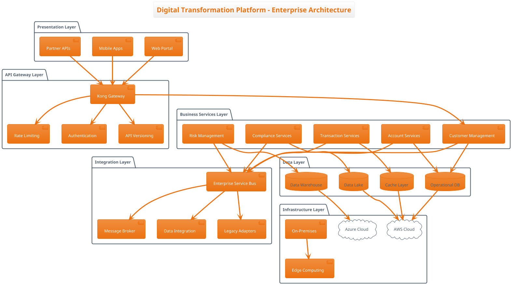

# GEMMA 4 ENTERPRISE BENCHMARK & EVALUATION PLAN
## 26B vs 31B Models Comparison
*Complete Step-by-Step Implementation Guide for Enterprise-Scale Models*

## OVERVIEW
**Objective:** Comprehensive evaluation of Gemma 4 26B and 31B models for enterprise-scale coding agent deployment  
**Primary Target:** Large-scale enterprise software development with maximum quality AI assistance  
**Expected Duration:** 6-8 hours (extended for enterprise-scale models)  
**Final Deliverable:** Complete enterprise benchmark report with performance data and deployment recommendations for server-grade infrastructure

**Key Differences from E2B/E4B Evaluation:**
- **Model Scale:** 26B (26 billion parameters) vs 31B (31 billion parameters) - 6-13x larger than E2B/E4B
- **Hardware Requirements:** Enterprise server-grade infrastructure (32GB-128GB RAM)
- **Use Case Focus:** Mission-critical enterprise applications requiring maximum quality
- **Performance Expectations:** Higher quality output, longer inference times, significant resource requirements

---

## PHASE 1: SETUP & ENVIRONMENT (Steps 1-3)

### STEP 1: Enterprise System Environment Documentation
**Commands to Execute:**
```bash
# System Hardware Specifications (Enterprise Focus)
system_profiler SPHardwareDataType

# Software Environment
system_profiler SPSoftwareDataType  

# Ollama Version and Configuration
ollama --version

# Current System Performance Baseline (Enterprise Load)
top -l 1 | head -15

# Available Disk Space (Large Model Requirements)
df -h

# Memory Configuration (Critical for Large Models)
vm_stat

# Battery Status Baseline (Server/Workstation Assessment)
pmset -g batt

# CPU Configuration Details
sysctl -n hw.ncpu hw.physicalcpu hw.logicalcpu
sysctl -n hw.memsize
```
**Expected Output:** Complete enterprise system specs for Report Section 3  
**File Output:** Save to `enterprise_system_environment.txt`

### STEP 2: Large Model Information Collection  
**Commands to Execute:**
```bash
# Model Configuration Details (26B and 31B)
ollama show gemma4:26b --modelfile
ollama show gemma4:31b --modelfile

# Model File Sizes (Expected 15-25GB each)
du -sh ~/.ollama/models/blobs/* | grep -E "(26b|31b)"

# List All Available Models
ollama list

# Model Loading Performance Test
time ollama run gemma4:26b "Test loading performance" > /dev/null
time ollama run gemma4:31b "Test loading performance" > /dev/null

# Memory Usage During Model Loading
echo "26B Model Memory Test:"
ollama run gemma4:26b "hello" &
sleep 5
ps aux | grep ollama
pkill -f "ollama run gemma4:26b"

echo "31B Model Memory Test:"
ollama run gemma4:31b "hello" &
sleep 5
ps aux | grep ollama
pkill -f "ollama run gemma4:31b"
```
**Expected Output:** Large model specifications for Report Section 2  
**File Output:** Save to `enterprise_model_specifications.txt`

### STEP 3: Enterprise Baseline Performance Measurement
**Commands to Execute:**
```bash
# Memory Usage Before Model Loading (Enterprise Monitoring)
top -pid $(pgrep ollama) -l 1

# System Temperature Baseline (Server Performance)
sudo powermetrics -i 1000 -n 5 | grep -E "(CPU die temperature|GPU die temperature)"

# Network and Process Check (Enterprise Environment)
ps aux | grep ollama
netstat -an | grep LISTEN

# Disk I/O Performance (Large Model Loading)
iostat -c 3 5

# System Load Average Monitoring
uptime
```
**Expected Output:** Enterprise baseline metrics for comparison  
**File Output:** Save to `enterprise_baseline_performance.txt`

---

## PHASE 2: CORE CAPABILITY TESTING (Steps 4-11)

### STEP 4: Advanced Reasoning Test - Enterprise System Analysis
**Test Scenario:** Large-Scale Distributed System Failure Analysis

**Prompt for Both Models:**
```
"A large-scale enterprise distributed system serving 100 million users globally is experiencing critical failures. As a principal architect, analyze these symptoms:

SYSTEM OVERVIEW:
- 500+ microservices across 12 AWS regions
- Kubernetes clusters with 10,000+ pods
- Multi-tier architecture (API Gateway → Service Mesh → Microservices → Databases)
- Real-time data processing (Apache Kafka, 50TB/day)
- Multi-database setup (PostgreSQL clusters, MongoDB, Redis, Elasticsearch)

CURRENT SYMPTOMS:
- API Gateway showing 25% of requests failing with 504 timeouts
- Service mesh (Istio) reporting circuit breakers open across 40% of service pairs
- Database connection pools exhausted across 15 PostgreSQL clusters (max 1000 connections each)
- Kafka consumer lag growing exponentially (currently 2.5 million messages behind)
- Memory leaks detected in Java services (heap growing from 4GB to 16GB over 8 hours)
- Elasticsearch cluster showing yellow status with 30% of shards unassigned
- Redis clusters experiencing failover events every 10-15 minutes
- Load balancers reporting 503 errors for 18% of traffic
- CDN cache hit ratio dropped from 95% to 31%
- DNS resolution failures increasing (5% failure rate)

BUSINESS IMPACT:
- Revenue loss: $50,000 per minute of degraded service
- Customer complaints increasing 400%
- SLA breaches affecting enterprise contracts
- Mobile app crash rates increased 300%

INFRASTRUCTURE DETAILS:
- AWS EC2 instances: mix of c5.24xlarge, r5.16xlarge, i3.8xlarge
- EKS clusters with Cluster Autoscaler and Horizontal Pod Autoscaler
- RDS Multi-AZ deployments with read replicas
- ElastiCache clusters in cluster mode
- Application Load Balancers with WAF enabled
- CloudFront distribution with custom origin policies

Provide a comprehensive analysis including:

1. PRIMARY ROOT CAUSE IDENTIFICATION:
   - Systematic analysis methodology
   - Evidence-based reasoning for the primary cause
   - Secondary and tertiary contributing factors
   - Timeline reconstruction of the failure cascade

2. IMMEDIATE STABILIZATION PLAN (0-4 hours):
   - Critical interventions to stop the bleeding
   - Resource scaling strategies
   - Circuit breaker and rate limiting adjustments
   - Database connection management
   - Kafka consumer rebalancing

3. SHORT-TERM RESOLUTION (4-24 hours):
   - Detailed remediation steps with priorities
   - Code fixes with implementation examples
   - Infrastructure adjustments
   - Monitoring and alerting improvements
   - Rollback procedures if fixes fail

4. LONG-TERM PREVENTION (1-4 weeks):
   - Architectural improvements
   - Capacity planning enhancements
   - Chaos engineering implementation
   - Observability stack improvements
   - Team process improvements

5. ENTERPRISE MONITORING STRATEGY:
   - SLI/SLO definitions for critical services
   - Distributed tracing implementation
   - Anomaly detection systems
   - Capacity planning automation
   - Incident response automation

6. BUSINESS CONTINUITY MEASURES:
   - Disaster recovery procedures
   - Multi-region failover strategies
   - Customer communication protocols
   - Financial impact mitigation

Provide specific code examples, infrastructure configurations, and monitoring setups. Include estimated timelines, resource requirements, and risk assessments for each recommendation."
```

**Execution Commands:**
```bash
# 26B Test
time ollama run gemma4:26b "[Full prompt above]" > reasoning_test_26b_enterprise.txt

# 31B Test  
time ollama run gemma4:31b "[Full prompt above]" > reasoning_test_31b_enterprise.txt
```

**Measurement Criteria:**
- Response time (minutes for large models)
- Solution depth and enterprise applicability (1-10 scale)
- Root cause identification accuracy and methodology
- Code solution quality and production readiness
- Business impact understanding
- Scalability of recommendations

### STEP 5: Advanced Reasoning Test - Enterprise Architecture Optimization
**Test Scenario:** Global E-commerce Platform Modernization

**Prompt for Both Models:**
```
"Design a comprehensive modernization strategy for a global e-commerce platform with these enterprise requirements:

CURRENT STATE:
- Legacy monolithic architecture (10+ years old, Java/Spring)
- 200 million registered users across 50 countries
- 50,000+ products, 1,000+ sellers
- Peak traffic: 500,000 concurrent users during sales events
- Current infrastructure: On-premises data centers in 5 regions
- Technology debt: Java 8, Spring 4.x, Oracle 11g, legacy messaging

BUSINESS REQUIREMENTS:
- Handle 1 billion users within 24 months
- Support real-time inventory across 10,000+ warehouses
- Sub-100ms response times for critical user journeys
- 99.99% availability with <$5M annual infrastructure budget
- Regulatory compliance: GDPR, PCI-DSS, SOX, CCPA
- Multi-currency support for 100+ currencies
- Real-time personalization and recommendations
- Support for 50x traffic spikes during flash sales
- Integration with 200+ external partners and APIs

TECHNICAL CONSTRAINTS:
- Zero-downtime migration required
- Maintain data consistency during transition
- Support existing mobile apps (iOS/Android)
- Integration with existing ERP, CRM, and warehouse systems
- Security: End-to-end encryption, multi-factor authentication
- Performance: 95th percentile response times <200ms

Provide a comprehensive enterprise modernization plan:

1. TARGET ARCHITECTURE DESIGN:
   - Microservices decomposition strategy (identify 20-30 core services)
   - Event-driven architecture with domain boundaries
   - API gateway and service mesh topology
   - Data architecture (CQRS, event sourcing, polyglot persistence)
   - Security architecture (zero trust, API security, data encryption)
   - Multi-region deployment strategy

2. TECHNOLOGY STACK SELECTION:
   - Programming languages and frameworks
   - Database technologies (SQL, NoSQL, search, cache)
   - Message brokers and event streaming platforms
   - Container orchestration and service mesh
   - Observability and monitoring stack
   - CI/CD and DevOps toolchain
   - Cloud provider services (AWS/Azure/GCP)

3. MIGRATION STRATEGY (24-month timeline):
   - Phase 1: Foundation and core services (0-6 months)
   - Phase 2: Customer-facing services (6-12 months)
   - Phase 3: Seller and inventory services (12-18 months)
   - Phase 4: Analytics and ML services (18-24 months)
   - Detailed strangler fig pattern implementation
   - Data migration strategies with zero downtime

4. IMPLEMENTATION DETAILS:
   - Complete code examples for critical components
   - Database schema designs for microservices
   - API specifications (OpenAPI/GraphQL)
   - Kubernetes manifests and Helm charts
   - Terraform/CloudFormation infrastructure as code
   - CI/CD pipeline configurations

5. SCALABILITY AND PERFORMANCE:
   - Auto-scaling strategies (horizontal and vertical)
   - Caching architecture (multi-tier, CDN, application cache)
   - Database sharding and partitioning strategies
   - Load balancing and traffic routing
   - Performance testing and capacity planning
   - Chaos engineering implementation

6. OPERATIONAL EXCELLENCE:
   - SRE practices and error budgets
   - Incident response and on-call procedures
   - Monitoring, logging, and distributed tracing
   - Security scanning and vulnerability management
   - Cost optimization and FinOps practices
   - Team organization and Conway's law considerations

7. RISK MITIGATION:
   - Technical risks and mitigation strategies
   - Business continuity planning
   - Rollback procedures for each migration phase
   - Security and compliance validation
   - Performance regression prevention
   - Vendor lock-in avoidance strategies

8. SUCCESS METRICS AND KPIs:
   - Technical metrics (latency, throughput, availability)
   - Business metrics (conversion rate, revenue impact)
   - Operational metrics (deployment frequency, MTTR)
   - Cost metrics (infrastructure cost per transaction)
   - Team metrics (developer productivity, time to market)

Include detailed cost analysis, timeline estimates, resource requirements, and technology evaluation matrices. Provide specific implementation examples and architecture diagrams in text format."
```

**Execution Commands:**
```bash
# 26B Test
time ollama run gemma4:26b "[Full prompt above]" > reasoning_test_26b_architecture.txt

# 31B Test
time ollama run gemma4:31b "[Full prompt above]" > reasoning_test_31b_architecture.txt
```

### STEP 6: Enterprise Agentic Workflow Test - Multi-step System Design
**Test Scenario:** Enterprise Banking Platform Development

**Sequential Prompts (Maintain Context):**

**Prompt 1 - Requirements Analysis:**
```
"You are a principal enterprise architect tasked with designing a new digital banking platform. Analyze these comprehensive requirements and create a detailed requirements specification:

BUSINESS REQUIREMENTS:
- Support 50 million customers across 25 countries
- Handle $1 trillion in annual transaction volume
- Real-time payments and cross-border transfers
- Regulatory compliance: Basel III, PCI-DSS, GDPR, PSD2, Open Banking
- Multi-channel support: web, mobile, API, branch integration
- 24/7 operations with 99.999% availability requirement

FUNCTIONAL REQUIREMENTS:
- Account management (checking, savings, investment, credit)
- Payment processing (domestic, international, instant payments)
- Loan origination and management
- Investment and wealth management
- Corporate banking services
- Risk management and fraud detection
- Customer onboarding with KYC/AML
- Reporting and analytics

NON-FUNCTIONAL REQUIREMENTS:
- Performance: <100ms for critical operations
- Security: End-to-end encryption, multi-factor authentication
- Scalability: Handle 10x growth over 5 years
- Integration: 500+ external systems and partners
- Compliance: Real-time regulatory reporting
- Disaster recovery: RTO <4 hours, RPO <15 minutes

Provide a comprehensive requirements analysis with:
1. Detailed functional decomposition
2. Non-functional requirements prioritization
3. Regulatory compliance mapping
4. Integration requirements analysis
5. Risk assessment and mitigation strategies
6. Success criteria and acceptance criteria
"
```

**Prompt 2 - Architecture Design:**
```
"Based on your previous requirements analysis, design a comprehensive enterprise architecture for the digital banking platform:

1. HIGH-LEVEL ARCHITECTURE:
   - System boundaries and context diagrams
   - Microservices decomposition (identify 30-40 services)
   - Data flow and integration patterns
   - Security architecture and trust boundaries
   - Deployment architecture across multiple regions

2. DETAILED COMPONENT DESIGN:
   - Core banking services architecture
   - Payment processing engine design
   - Risk management and fraud detection systems
   - Customer onboarding and KYC workflows
   - API gateway and service mesh design
   - Data platform architecture (operational and analytical)

3. TECHNOLOGY STACK:
   - Programming languages and frameworks
   - Database technologies (transactional and analytical)
   - Message brokers and event streaming
   - Cloud services and infrastructure
   - Security and compliance tools
   - Monitoring and observability stack

Provide detailed architecture diagrams in text format, technology justifications, and integration patterns."
```

**Prompt 3 - Implementation Plan:**
```
"Create a detailed implementation plan for the digital banking platform based on your architecture design:

1. IMPLEMENTATION PHASES (36-month timeline):
   - Phase 1: Core infrastructure and foundation services (0-9 months)
   - Phase 2: Customer-facing services and basic banking (9-18 months)
   - Phase 3: Advanced services and integrations (18-27 months)
   - Phase 4: Analytics, ML, and optimization (27-36 months)

2. TECHNICAL IMPLEMENTATION:
   - Development methodology and team structure
   - CI/CD pipeline design and implementation
   - Testing strategy (unit, integration, performance, security)
   - Deployment strategy and infrastructure automation
   - Monitoring and alerting implementation
   - Security implementation and compliance validation

3. RISK MANAGEMENT:
   - Technical risk identification and mitigation
   - Regulatory compliance validation
   - Performance and scalability testing
   - Security testing and penetration testing
   - Business continuity and disaster recovery testing

Provide detailed project plans, resource estimates, and milestone definitions."
```

**Prompt 4 - Code Implementation:**
```
"Implement critical components of the digital banking platform based on your implementation plan:

1. CORE BANKING SERVICE:
   - Account management microservice
   - Transaction processing engine
   - Event sourcing implementation for audit trails
   - API endpoints for banking operations

2. PAYMENT PROCESSING:
   - Real-time payment processing service
   - International transfer handling
   - Fraud detection integration
   - Regulatory reporting automation

3. SECURITY IMPLEMENTATION:
   - Authentication and authorization service
   - API security and rate limiting
   - Data encryption and key management
   - Audit logging and compliance monitoring

Provide production-ready code with comprehensive error handling, logging, monitoring, and security features. Include unit tests and integration tests."
```

**Prompt 5 - Operations and Monitoring:**
```
"Design and implement comprehensive operations and monitoring for the digital banking platform:

1. OBSERVABILITY STACK:
   - Metrics collection and dashboards
   - Distributed tracing implementation
   - Centralized logging and analysis
   - Real-time alerting and notification

2. OPERATIONAL PROCEDURES:
   - Incident response procedures
   - Change management processes
   - Capacity planning and scaling procedures
   - Disaster recovery and business continuity
   - Security monitoring and threat detection

3. COMPLIANCE MONITORING:
   - Regulatory reporting automation
   - Audit trail maintenance and analysis
   - Compliance dashboard and KPI tracking
   - Automated compliance validation

Provide detailed operational runbooks, monitoring configurations, and compliance procedures."
```

**Execution Commands:**
```bash
# 26B Agentic Test
time ollama run gemma4:26b "[Prompt 1]" > agentic_26b_step1_enterprise.txt
time ollama run gemma4:26b "[Prompt 2]" > agentic_26b_step2_enterprise.txt
time ollama run gemma4:26b "[Prompt 3]" > agentic_26b_step3_enterprise.txt
time ollama run gemma4:26b "[Prompt 4]" > agentic_26b_step4_enterprise.txt
time ollama run gemma4:26b "[Prompt 5]" > agentic_26b_step5_enterprise.txt

# 31B Agentic Test (same sequence)
time ollama run gemma4:31b "[Prompt 1]" > agentic_31b_step1_enterprise.txt
time ollama run gemma4:31b "[Prompt 2]" > agentic_31b_step2_enterprise.txt
time ollama run gemma4:31b "[Prompt 3]" > agentic_31b_step3_enterprise.txt
time ollama run gemma4:31b "[Prompt 4]" > agentic_31b_step4_enterprise.txt
time ollama run gemma4:31b "[Prompt 5]" > agentic_31b_step5_enterprise.txt
```

**Measurement Criteria:**
- Context retention across complex steps (1-10 scale)
- Enterprise-level thinking and planning quality
- Code quality and production readiness
- Architecture complexity and appropriateness
- Business understanding and compliance awareness

### STEP 7: Enterprise Full-stack Development Test
**Test Scenario:** Enterprise Resource Planning (ERP) System

**Prompt for Both Models:**
```
"Act as a principal enterprise architect and lead developer. Build a comprehensive Enterprise Resource Planning (ERP) system for a multinational manufacturing company with 50,000+ employees. Execute each step methodically with enterprise-grade implementation.

BUSINESS CONTEXT:
- Manufacturing company with 200+ locations globally
- Complex supply chain with 10,000+ suppliers
- Multi-currency operations in 40+ countries
- Regulatory requirements: SOX, GDPR, country-specific regulations
- Integration with existing systems: SAP, Oracle, Salesforce, legacy mainframes

SYSTEM REQUIREMENTS:
- Multi-tenant architecture supporting different business units
- Real-time data processing and analytics
- Mobile-first design for factory workers and field personnel
- Offline capability for remote locations
- Advanced security and compliance features
- Support for 100,000+ concurrent users

STEP 1: Enterprise Data Architecture
Design a comprehensive data architecture including:
- Master data management (customers, suppliers, products, employees)
- Transactional data (orders, invoices, payments, inventory)
- Analytical data warehouse and data lake
- Real-time data streaming and processing
- Data governance and compliance
- Multi-region data replication and consistency
Provide complete database schemas, data flow diagrams, and ETL processes.

STEP 2: Microservices Architecture
Create a full microservices architecture with:
- Domain-driven design with bounded contexts
- 40+ microservices covering all ERP modules
- Event-driven architecture with saga patterns
- API gateway and service mesh (Istio)
- Service discovery and configuration management
- Circuit breakers and resilience patterns
Provide service definitions, API contracts, and integration patterns.

STEP 3: Backend Implementation (Java/Spring Boot)
Implement core ERP modules:
- Financial management (accounting, budgeting, reporting)
- Supply chain management (procurement, inventory, logistics)
- Human resources (payroll, benefits, performance)
- Customer relationship management
- Manufacturing execution system (MES)
- Business intelligence and analytics
Include comprehensive security, audit logging, and compliance features.

STEP 4: Frontend Implementation (React/Angular)
Build enterprise-grade user interfaces:
- Role-based dashboards for different user types
- Mobile-responsive design for all devices
- Real-time data visualization and analytics
- Workflow management and approval processes
- Document management and collaboration
- Multi-language and localization support
Include accessibility compliance (WCAG 2.1) and modern UX patterns.

STEP 5: Integration Layer
Implement comprehensive integration capabilities:
- Enterprise service bus (ESB) with message routing
- API management and gateway
- ETL/ELT processes for data integration
- Real-time data synchronization
- Legacy system integration adapters
- Third-party service integrations (payment, shipping, etc.)
- B2B integration (EDI, APIs, file transfers)

STEP 6: Security and Compliance
Implement enterprise security framework:
- Identity and access management (IAM)
- Single sign-on (SSO) and multi-factor authentication
- Role-based access control (RBAC) with fine-grained permissions
- Data encryption at rest and in transit
- Audit logging and compliance reporting
- Vulnerability scanning and security monitoring
- GDPR compliance with data privacy controls

STEP 7: DevOps and Infrastructure
Create comprehensive DevOps pipeline:
- Infrastructure as Code (Terraform/ARM templates)
- Container orchestration (Kubernetes)
- CI/CD pipelines with automated testing
- Blue-green deployments and canary releases
- Monitoring and observability (Prometheus, Grafana, Jaeger)
- Log aggregation and analysis (ELK stack)
- Backup and disaster recovery automation

STEP 8: Performance and Scalability
Implement performance optimization:
- Database optimization and indexing strategies
- Caching layers (Redis, CDN, application cache)
- Load balancing and auto-scaling
- Performance monitoring and APM
- Capacity planning and resource optimization
- Database sharding and read replicas
- CDN implementation for global performance

Execute each step completely with production-ready code, configurations, and documentation. Include error handling, logging, monitoring, and comprehensive testing for each component."
```

**Execution Commands:**
```bash
# 26B Full-stack Enterprise Test
time ollama run gemma4:26b "[Full prompt above]" > fullstack_26b_enterprise.txt

# 31B Full-stack Enterprise Test  
time ollama run gemma4:31b "[Full prompt above]" > fullstack_31b_enterprise.txt
```

### STEP 8: Advanced Enterprise Architecture Test
**Test Scenario:** Cloud-Native Digital Transformation Platform

**Prompt for Both Models:**
```
"Design and implement a comprehensive cloud-native digital transformation platform for Fortune 500 companies using modern enterprise architecture patterns:

PLATFORM REQUIREMENTS:
- Multi-tenant SaaS platform serving 1000+ enterprise clients
- Support for multiple cloud providers (AWS, Azure, GCP, hybrid)
- Event-driven microservices architecture with domain-driven design
- Real-time data processing and analytics at petabyte scale
- Global deployment across 20+ regions with edge computing
- Enterprise security and compliance (SOC 2, ISO 27001, FedRAMP)
- 99.99% availability with automatic failover and disaster recovery

ARCHITECTURAL COMPONENTS:

1. PLATFORM FOUNDATION:
   - Multi-cloud abstractions and cloud-agnostic deployments
   - Container orchestration with advanced Kubernetes patterns
   - Service mesh architecture (Istio/Linkerd) with advanced traffic management
   - API gateway with rate limiting, caching, and transformation
   - Event streaming platform with Apache Kafka and Pulsar
   - Distributed configuration management and service discovery

2. DATA PLATFORM:
   - Lambda/Kappa architecture for real-time and batch processing
   - Data lake with delta lake architecture (Apache Iceberg/Delta Lake)
   - Stream processing with Apache Flink and Kafka Streams
   - Master data management with Apache Atlas
   - Data lineage and governance with automated compliance
   - Real-time OLAP with Apache Druid and ClickHouse

3. AI/ML PLATFORM:
   - MLOps pipeline with automated model training and deployment
   - Feature store with real-time and batch feature serving
   - Model governance and explainability platform
   - AutoML capabilities for citizen data scientists
   - Real-time inference with model serving (Seldon/KFServing)
   - A/B testing platform for ML models

4. INTEGRATION PLATFORM:
   - Enterprise integration patterns (EIP) implementation
   - API marketplace with developer portal
   - Event-driven integrations with choreography and orchestration
   - Legacy system integration with change data capture (CDC)
   - B2B integration with industry standard protocols
   - Real-time data synchronization across systems

5. SECURITY PLATFORM:
   - Zero-trust security architecture
   - Identity and access management with policy-based controls
   - Secrets management and certificate automation
   - Security scanning and vulnerability management
   - Threat detection and response automation
   - Compliance automation and continuous monitoring

IMPLEMENTATION REQUIREMENTS:

Provide complete implementation including:

1. ARCHITECTURE DESIGN:
   - C4 model architecture diagrams (context, container, component, code)
   - Service decomposition with bounded contexts
   - Data flow and event flow diagrams
   - Security architecture and trust boundaries
   - Deployment architecture with network topology

2. MICROSERVICES IMPLEMENTATION:
   - 50+ microservices with clear domain boundaries
   - Event sourcing and CQRS implementation
   - Saga pattern for distributed transactions
   - API-first design with OpenAPI specifications
   - Asynchronous communication patterns

3. INFRASTRUCTURE AS CODE:
   - Complete Terraform modules for multi-cloud deployment
   - Kubernetes operators for custom resources
   - Helm charts with advanced templating
   - GitOps workflows with ArgoCD/Flux
   - Infrastructure testing and validation

4. OBSERVABILITY IMPLEMENTATION:
   - Distributed tracing with OpenTelemetry
   - Metrics collection with Prometheus and custom metrics
   - Centralized logging with structured logging
   - SLI/SLO monitoring with error budgets
   - Chaos engineering implementation

5. DATA ENGINEERING:
   - Real-time data pipelines with Apache Beam
   - Data quality monitoring and validation
   - Schema evolution and compatibility management
   - Data catalog with automated documentation
   - Privacy-preserving analytics implementation

6. SECURITY IMPLEMENTATION:
   - OAuth2/OIDC with policy-based authorization
   - mTLS implementation across all services
   - Secret management with HashiCorp Vault
   - Network policies and service mesh security
   - Compliance automation with Open Policy Agent

Provide production-ready code, configurations, and operational procedures. Include performance benchmarks, capacity planning, cost optimization strategies, and detailed migration procedures from legacy systems."
```

**Execution Commands:**
```bash
# 26B Architecture Test
time ollama run gemma4:26b "[Full prompt above]" > architecture_26b_enterprise.txt

# 31B Architecture Test
time ollama run gemma4:31b "[Full prompt above]" > architecture_31b_enterprise.txt
```

### STEP 9: Enterprise Security & Compliance Test
**Test Scenario:** Multi-Regulatory Compliance Platform

**Prompt for Both Models:**
```
"Design and implement a comprehensive enterprise security and compliance platform that meets multiple regulatory requirements for a global financial services company:

REGULATORY REQUIREMENTS:
- Financial: Basel III, MiFID II, Dodd-Frank, CFTC, SEC regulations
- Data Protection: GDPR, CCPA, PIPEDA, LGPD
- Security: PCI-DSS Level 1, SOC 2 Type II, ISO 27001, NIST Cybersecurity Framework
- Industry: SWIFT CSP, FCA regulations, FINMA guidelines
- Cross-border: Data residency laws, cross-border data transfer restrictions

BUSINESS CONTEXT:
- Global investment bank with operations in 40+ countries
- $500 billion assets under management
- Real-time trading systems processing millions of transactions daily
- 50,000+ employees across multiple business units
- Complex third-party vendor ecosystem (500+ vendors)
- Multiple data centers and cloud environments

SECURITY PLATFORM REQUIREMENTS:

1. COMPREHENSIVE SECURITY ANALYSIS:
Analyze and provide solutions for:

a) IDENTITY AND ACCESS MANAGEMENT:
   - Zero-trust architecture implementation
   - Privileged access management (PAM)
   - Identity governance and administration (IGA)
   - Multi-factor authentication with adaptive authentication
   - Single sign-on (SSO) across all applications
   - Just-in-time (JIT) access provisioning
   - Identity federation across multiple domains

b) DATA PROTECTION AND PRIVACY:
   - Data classification and labeling automation
   - Data loss prevention (DLP) across all channels
   - Encryption key management and rotation
   - Tokenization and format-preserving encryption
   - Privacy impact assessments (PIA) automation
   - Data subject rights management (GDPR Article 15-22)
   - Cross-border data transfer compliance

c) APPLICATION SECURITY:
   - Secure software development lifecycle (SSDLC)
   - Static application security testing (SAST)
   - Dynamic application security testing (DAST)
   - Interactive application security testing (IAST)
   - Software composition analysis (SCA)
   - Container and Kubernetes security
   - API security and protection

d) INFRASTRUCTURE SECURITY:
   - Network segmentation and micro-segmentation
   - Intrusion detection and prevention systems
   - Security information and event management (SIEM)
   - User and entity behavior analytics (UEBA)
   - Endpoint detection and response (EDR)
   - Cloud security posture management (CSPM)
   - Infrastructure vulnerability management

2. COMPLIANCE AUTOMATION PLATFORM:

Implement comprehensive compliance management:

a) REGULATORY REPORTING:
   - Automated regulatory report generation
   - Real-time compliance monitoring and alerting
   - Exception management and remediation workflows
   - Regulatory change management system
   - Cross-jurisdictional compliance mapping
   - Audit trail and evidence collection

b) RISK MANAGEMENT:
   - Operational risk assessment automation
   - Third-party risk management (TPRM)
   - Cyber risk quantification and modeling
   - Business continuity and disaster recovery
   - Crisis management and incident response
   - Risk appetite framework implementation

c) POLICY AND GOVERNANCE:
   - Policy management lifecycle
   - Automated policy compliance checking
   - Control testing and validation
   - Compliance training and awareness
   - Compliance dashboard and KPI monitoring
   - Management reporting and attestation

3. IMPLEMENTATION DETAILS:

Provide complete implementation including:

a) SECURITY ARCHITECTURE:
   - Defense-in-depth security architecture
   - Threat modeling and risk assessment
   - Security control mapping to regulations
   - Incident response and forensics capabilities
   - Business continuity and disaster recovery
   - Third-party security assessment framework

b) TECHNOLOGY IMPLEMENTATION:
   - Security orchestration, automation, and response (SOAR)
   - Cloud-native security tools and platforms
   - DevSecOps pipeline integration
   - Security testing automation
   - Continuous compliance monitoring
   - Security metrics and KPI dashboards

c) OPERATIONAL PROCEDURES:
   - Security operations center (SOC) procedures
   - Incident response playbooks
   - Compliance audit preparation and execution
   - Vendor security assessment procedures
   - Employee security training and awareness
   - Security architecture review processes

4. SPECIFIC COMPLIANCE IMPLEMENTATIONS:

a) GDPR COMPLIANCE:
   - Data mapping and inventory automation
   - Consent management platform
   - Data subject access request (DSAR) automation
   - Privacy by design implementation
   - Data breach notification automation
   - Privacy impact assessment (PIA) workflows

b) PCI-DSS COMPLIANCE:
   - Cardholder data environment (CDE) segmentation
   - Payment application security validation
   - Network security testing automation
   - Regular security testing procedures
   - Compensating controls implementation
   - Quarterly compliance reporting

c) SOC 2 TYPE II:
   - Control implementation and testing
   - Continuous monitoring and alerting
   - Evidence collection and management
   - Service auditor interaction procedures
   - Management assertion preparation
   - Control deficiency remediation

5. ADVANCED SECURITY CAPABILITIES:

a) THREAT INTELLIGENCE:
   - Threat intelligence platform integration
   - Automated threat hunting procedures
   - Attribution and campaign tracking
   - Indicator of compromise (IoC) sharing
   - Threat landscape analysis and reporting
   - Predictive threat modeling

b) SECURITY ANALYTICS:
   - Machine learning for anomaly detection
   - Behavioral analytics implementation
   - Security data lake architecture
   - Advanced persistent threat (APT) detection
   - Fraud detection and prevention
   - Security incident correlation and analysis

Provide production-ready code, configurations, policies, procedures, and compliance documentation. Include implementation timelines, resource requirements, technology selection criteria, and detailed compliance validation procedures."
```

**Execution Commands:**
```bash
# 26B Security Test
time ollama run gemma4:26b "[Full prompt above]" > security_26b_enterprise.txt

# 31B Security Test
time ollama run gemma4:31b "[Full prompt above]" > security_31b_enterprise.txt
```

### STEP 10: Enterprise Framework Integration Test
**Test Scenario:** Multi-Framework Enterprise Integration

**Prompt for Both Models:**
```
"Implement a comprehensive enterprise integration platform that seamlessly connects multiple enterprise frameworks and technologies for a large multinational corporation:

ENTERPRISE CONTEXT:
- Fortune 100 company with 500,000+ employees
- Operations in 100+ countries with complex regulatory requirements
- Hybrid cloud environment (AWS, Azure, on-premises, edge computing)
- Legacy systems dating back 30+ years alongside modern cloud-native applications
- Real-time requirements for trading, manufacturing, and customer-facing systems
- Complex mergers and acquisitions requiring rapid system integration

INTEGRATION REQUIREMENTS:

1. COMPREHENSIVE FRAMEWORK INTEGRATION:

a) JAVA ENTERPRISE FRAMEWORKS:
   - Spring Boot 3.x with Spring Cloud ecosystem
   - Jakarta EE 10 with modern application servers
   - Quarkus for cloud-native Java applications
   - Apache Camel for enterprise integration patterns
   - Hibernate/JPA with multiple database support
   - Spring Security with OAuth2/OIDC implementation

b) .NET ENTERPRISE FRAMEWORKS:
   - .NET 8 with minimal APIs and microservices
   - ASP.NET Core with SignalR for real-time communication
   - Entity Framework Core with multiple providers
   - MassTransit for distributed application messaging
   - IdentityServer for authentication and authorization
   - Blazor for modern web applications

c) NODE.JS ENTERPRISE FRAMEWORKS:
   - Express.js with enterprise middleware
   - NestJS with dependency injection and decorators
   - Fastify for high-performance APIs
   - Socket.IO for real-time bidirectional communication
   - Prisma/TypeORM for database access
   - Passport.js for authentication strategies

d) PYTHON ENTERPRISE FRAMEWORKS:
   - FastAPI for high-performance async APIs
   - Django with Django REST Framework
   - Flask with enterprise extensions
   - Celery for distributed task processing
   - SQLAlchemy with Alembic migrations
   - Apache Airflow for workflow orchestration

e) GO ENTERPRISE FRAMEWORKS:
   - Gin/Echo for high-performance web services
   - gRPC for inter-service communication
   - GORM for database operations
   - Viper for configuration management
   - Zap for structured logging
   - Testify for comprehensive testing

2. INTEGRATION PLATFORM IMPLEMENTATION:

a) API MANAGEMENT AND GATEWAY:
   - Kong/Ambassador/Istio Gateway implementation
   - Rate limiting, throttling, and quota management
   - API versioning and lifecycle management
   - Request/response transformation and validation
   - Circuit breaker and retry patterns
   - API analytics and monitoring

b) MESSAGE BROKER INTEGRATION:
   - Apache Kafka with Schema Registry
   - Apache Pulsar for geo-distributed messaging
   - RabbitMQ for complex routing scenarios
   - Apache ActiveMQ for JMS compatibility
   - Redis Pub/Sub for lightweight messaging
   - Event sourcing and CQRS implementation

c) DATABASE INTEGRATION:
   - Multi-database support (PostgreSQL, Oracle, SQL Server, MySQL)
   - NoSQL integration (MongoDB, Cassandra, DynamoDB)
   - Time-series databases (InfluxDB, TimescaleDB)
   - Graph databases (Neo4j, Amazon Neptune)
   - Search engines (Elasticsearch, Solr)
   - Caching layers (Redis, Memcached, Hazelcast)

d) ENTERPRISE SERVICE BUS:
   - Apache ServiceMix/Fuse integration
   - MuleSoft Anypoint Platform connectivity
   - IBM Integration Bus/App Connect compatibility
   - Microsoft BizTalk Server integration
   - TIBCO BusinessWorks connectivity
   - Custom ESB implementation with routing patterns

3. SPECIFIC FRAMEWORK IMPLEMENTATIONS:

a) SPRING BOOT MICROSERVICES PLATFORM:
```java
// Complete Spring Boot microservice template
@SpringBootApplication
@EnableEurekaClient
@EnableJpaRepositories
@EnableRabbitMQ
@EnableRedisHttpSession
@EnableOAuth2ResourceServer
public class EnterpriseServiceApplication {
    // Implementation with all enterprise patterns
}

// Service implementation with comprehensive patterns
@Service
@Transactional
@Validated
public class EnterpriseBusinessService {
    // Circuit breaker, retry, caching, audit logging
}

// Repository with multi-database support
@Repository
public interface EnterpriseRepository extends JpaRepository<Entity, UUID> {
    // Custom queries with performance optimization
}
```

b) .NET ENTERPRISE SERVICE IMPLEMENTATION:
```csharp
// Complete .NET enterprise service template
[ApiController]
[Route("api/v1/[controller]")]
[Authorize(Policy = "EnterprisePolicy")]
public class EnterpriseController : ControllerBase
{
    // Implementation with dependency injection, logging, validation
}

// Service with comprehensive patterns
public class EnterpriseBusinessService : IEnterpriseService
{
    // Circuit breaker, retry policies, caching, audit logging
}

// Entity Framework integration
public class EnterpriseDbContext : DbContext
{
    // Multi-tenant support, audit trails, performance optimization
}
```

c) NODE.JS ENTERPRISE API IMPLEMENTATION:
```typescript
// Complete NestJS enterprise module
@Module({
  imports: [
    TypeOrmModule,
    RedisModule,
    BullModule,
    PassportModule,
    JwtModule
  ],
  controllers: [EnterpriseController],
  providers: [EnterpriseService]
})
export class EnterpriseModule {}

// Service with enterprise patterns
@Injectable()
export class EnterpriseService {
  // Async processing, caching, circuit breakers, observability
}
```

4. INTEGRATION PATTERNS IMPLEMENTATION:

a) ENTERPRISE INTEGRATION PATTERNS:
   - Message routing and filtering
   - Content-based routing
   - Publish-subscribe patterns
   - Request-reply and correlation patterns
   - Scatter-gather and aggregation patterns
   - Dead letter queues and error handling
   - Message transformation and translation

b) DATA INTEGRATION PATTERNS:
   - Change data capture (CDC) implementation
   - Event-driven data synchronization
   - Master data management integration
   - Data virtualization and federation
   - Real-time data streaming pipelines
   - Batch processing and ETL workflows
   - Data quality and validation frameworks

c) SECURITY INTEGRATION PATTERNS:
   - Cross-framework authentication federation
   - Token translation and validation
   - Policy-based authorization
   - Audit logging standardization
   - Encryption key management
   - Certificate management automation
   - Security event correlation

5. OPERATIONAL EXCELLENCE:

a) OBSERVABILITY INTEGRATION:
   - Distributed tracing across all frameworks
   - Metrics collection and correlation
   - Centralized logging with structured logs
   - Health checks and readiness probes
   - Performance monitoring and APM
   - Business metrics and KPI tracking

b) DEPLOYMENT AND OPERATIONS:
   - Multi-framework CI/CD pipelines
   - Container orchestration with Kubernetes
   - Service mesh integration (Istio/Linkerd)
   - Configuration management across frameworks
   - Secret management and rotation
   - Disaster recovery and backup strategies

c) TESTING STRATEGIES:
   - Contract testing with Pact
   - Integration testing across frameworks
   - Performance and load testing
   - Security testing automation
   - Chaos engineering implementation
   - End-to-end testing orchestration

Provide complete, production-ready implementations for each framework with comprehensive error handling, logging, monitoring, security, and testing. Include detailed integration guides, best practices, performance optimization techniques, and troubleshooting procedures."
```

**Execution Commands:**
```bash
# 26B Framework Test
time ollama run gemma4:26b "[Full prompt above]" > framework_26b_enterprise.txt

# 31B Framework Test
time ollama run gemma4:31b "[Full prompt above]" > framework_31b_enterprise.txt
```

### STEP 11: Enterprise Multimodal Documentation Test
**Test Scenario:** Comprehensive Enterprise Documentation Suite

**Prompt for Both Models:**
```
"Create a comprehensive enterprise documentation suite for a large-scale digital transformation program, including technical documentation, architectural diagrams, and operational procedures:

PROGRAM CONTEXT:
- 5-year digital transformation for Fortune 100 financial services company
- $2 billion investment across 200+ projects
- 10,000+ employees affected across 40+ countries
- Migration from legacy mainframes to cloud-native architecture
- Regulatory compliance in multiple jurisdictions
- Integration with 1,000+ external systems and partners

DOCUMENTATION REQUIREMENTS:

1. ENTERPRISE ARCHITECTURE DOCUMENTATION:

Create comprehensive architecture documentation including:

a) SYSTEM ARCHITECTURE DIAGRAMS (in PlantUML format):


b) DETAILED COMPONENT DIAGRAMS:
- Microservices decomposition diagrams
- Database entity relationship diagrams
- Network topology and security zones
- Deployment architecture across environments
- Data flow and integration patterns
- Security architecture and trust boundaries

c) SEQUENCE DIAGRAMS:
- Customer onboarding process flows
- Transaction processing workflows
- Risk assessment and compliance checks
- Incident response procedures
- Disaster recovery sequences
- API authentication and authorization flows

2. TECHNICAL DOCUMENTATION SUITE:

a) API DOCUMENTATION:
```yaml
openapi: 3.0.3
info:
  title: Enterprise Customer Management API
  description: Comprehensive API for customer lifecycle management
  version: 2.0.0
  contact:
    name: Enterprise Architecture Team
    email: api-support@company.com
  license:
    name: Proprietary
    url: https://company.com/license

servers:
  - url: https://api.company.com/v2
    description: Production environment
  - url: https://api-staging.company.com/v2
    description: Staging environment

security:
  - OAuth2:
      - customer:read
      - customer:write
  - ApiKeyAuth: []

paths:
  /customers:
    get:
      summary: Retrieve customer list
      description: Returns a paginated list of customers with optional filtering
      parameters:
        - name: page
          in: query
          schema:
            type: integer
            minimum: 1
            default: 1
        - name: size
          in: query
          schema:
            type: integer
            minimum: 1
            maximum: 100
            default: 20
        - name: status
          in: query
          schema:
            type: string
            enum: [active, inactive, suspended]
      responses:
        '200':
          description: Successful response with customer list
          content:
            application/json:
              schema:
                type: object
                properties:
                  data:
                    type: array
                    items:
                      $ref: '#/components/schemas/Customer'
                  pagination:
                    $ref: '#/components/schemas/PaginationInfo'
        '400':
          $ref: '#/components/responses/BadRequest'
        '401':
          $ref: '#/components/responses/Unauthorized'
        '403':
          $ref: '#/components/responses/Forbidden'
        '500':
          $ref: '#/components/responses/InternalServerError'

components:
  schemas:
    Customer:
      type: object
      required:
        - customerId
        - firstName
        - lastName
        - email
      properties:
        customerId:
          type: string
          format: uuid
          description: Unique customer identifier
        firstName:
          type: string
          maxLength: 50
          description: Customer first name
        lastName:
          type: string
          maxLength: 50
          description: Customer last name
        email:
          type: string
          format: email
          description: Customer email address
        phoneNumber:
          type: string
          pattern: '^[\+]?[1-9][\d]{0,15}$'
          description: Customer phone number in E.164 format
        dateOfBirth:
          type: string
          format: date
          description: Customer date of birth
        status:
          type: string
          enum: [active, inactive, suspended]
          description: Customer account status
        createdAt:
          type: string
          format: date-time
          description: Account creation timestamp
        updatedAt:
          type: string
          format: date-time
          description: Last update timestamp
```

b) DEVELOPER GUIDES:
- Getting started guide for new developers
- Local development environment setup
- Testing strategies and test data management
- Code review guidelines and standards
- Security coding practices and standards
- Performance optimization guidelines
- Troubleshooting common issues guide

c) DATABASE DOCUMENTATION:
```sql
-- Customer Management Database Schema
-- Version: 2.0.0
-- Last Updated: 2026-04-27

-- Drop existing tables (for clean installation)
DROP TABLE IF EXISTS customer_audit CASCADE;
DROP TABLE IF EXISTS customer_preferences CASCADE;
DROP TABLE IF EXISTS customer_addresses CASCADE;
DROP TABLE IF EXISTS customers CASCADE;

-- Create customers table
CREATE TABLE customers (
    customer_id UUID PRIMARY KEY DEFAULT gen_random_uuid(),
    customer_number VARCHAR(20) UNIQUE NOT NULL,
    first_name VARCHAR(50) NOT NULL,
    last_name VARCHAR(50) NOT NULL,
    middle_name VARCHAR(50),
    email VARCHAR(100) UNIQUE NOT NULL,
    phone_number VARCHAR(20),
    date_of_birth DATE,
    social_security_number VARCHAR(11) ENCRYPTED,
    status VARCHAR(20) NOT NULL DEFAULT 'active',
    risk_rating VARCHAR(10) DEFAULT 'low',
    kyc_status VARCHAR(20) DEFAULT 'pending',
    kyc_completed_date TIMESTAMP,
    created_at TIMESTAMP NOT NULL DEFAULT CURRENT_TIMESTAMP,
    updated_at TIMESTAMP NOT NULL DEFAULT CURRENT_TIMESTAMP,
    created_by VARCHAR(50) NOT NULL,
    updated_by VARCHAR(50) NOT NULL,
    version INTEGER NOT NULL DEFAULT 1,
    
    CONSTRAINT chk_customers_status CHECK (status IN ('active', 'inactive', 'suspended', 'closed')),
    CONSTRAINT chk_customers_risk_rating CHECK (risk_rating IN ('low', 'medium', 'high')),
    CONSTRAINT chk_customers_kyc_status CHECK (kyc_status IN ('pending', 'in_progress', 'completed', 'failed'))
);

-- Create indexes for performance
CREATE INDEX idx_customers_email ON customers(email);
CREATE INDEX idx_customers_phone_number ON customers(phone_number);
CREATE INDEX idx_customers_status ON customers(status);
CREATE INDEX idx_customers_created_at ON customers(created_at);
CREATE INDEX idx_customers_customer_number ON customers(customer_number);

-- Create audit table for compliance
CREATE TABLE customer_audit (
    audit_id UUID PRIMARY KEY DEFAULT gen_random_uuid(),
    customer_id UUID NOT NULL,
    operation VARCHAR(10) NOT NULL,
    old_values JSONB,
    new_values JSONB,
    changed_by VARCHAR(50) NOT NULL,
    changed_at TIMESTAMP NOT NULL DEFAULT CURRENT_TIMESTAMP,
    ip_address INET,
    user_agent TEXT,
    
    CONSTRAINT chk_audit_operation CHECK (operation IN ('INSERT', 'UPDATE', 'DELETE'))
);

-- Create trigger for audit logging
CREATE OR REPLACE FUNCTION customer_audit_trigger()
RETURNS TRIGGER AS $$
BEGIN
    IF TG_OP = 'DELETE' THEN
        INSERT INTO customer_audit (customer_id, operation, old_values, changed_by)
        VALUES (OLD.customer_id, TG_OP, to_jsonb(OLD), OLD.updated_by);
        RETURN OLD;
    ELSIF TG_OP = 'UPDATE' THEN
        INSERT INTO customer_audit (customer_id, operation, old_values, new_values, changed_by)
        VALUES (NEW.customer_id, TG_OP, to_jsonb(OLD), to_jsonb(NEW), NEW.updated_by);
        RETURN NEW;
    ELSIF TG_OP = 'INSERT' THEN
        INSERT INTO customer_audit (customer_id, operation, new_values, changed_by)
        VALUES (NEW.customer_id, TG_OP, to_jsonb(NEW), NEW.created_by);
        RETURN NEW;
    END IF;
    RETURN NULL;
END;
$$ LANGUAGE plpgsql;

CREATE TRIGGER customer_audit_trigger
    AFTER INSERT OR UPDATE OR DELETE ON customers
    FOR EACH ROW EXECUTE FUNCTION customer_audit_trigger();
```

3. OPERATIONAL DOCUMENTATION:

a) DEPLOYMENT GUIDES:
```yaml
# Kubernetes Deployment Configuration
apiVersion: apps/v1
kind: Deployment
metadata:
  name: customer-service
  namespace: enterprise
  labels:
    app: customer-service
    version: v2.0.0
    tier: backend
spec:
  replicas: 3
  selector:
    matchLabels:
      app: customer-service
  template:
    metadata:
      labels:
        app: customer-service
        version: v2.0.0
    spec:
      serviceAccountName: customer-service-sa
      containers:
      - name: customer-service
        image: enterprise-registry.com/customer-service:2.0.0
        ports:
        - containerPort: 8080
          name: http
        - containerPort: 8081
          name: health
        env:
        - name: SPRING_PROFILES_ACTIVE
          value: "kubernetes"
        - name: DATABASE_URL
          valueFrom:
            secretKeyRef:
              name: database-credentials
              key: url
        - name: DATABASE_USERNAME
          valueFrom:
            secretKeyRef:
              name: database-credentials
              key: username
        - name: DATABASE_PASSWORD
          valueFrom:
            secretKeyRef:
              name: database-credentials
              key: password
        resources:
          requests:
            memory: "512Mi"
            cpu: "250m"
          limits:
            memory: "2Gi"
            cpu: "1000m"
        livenessProbe:
          httpGet:
            path: /actuator/health/liveness
            port: 8081
          initialDelaySeconds: 30
          periodSeconds: 30
          timeoutSeconds: 10
        readinessProbe:
          httpGet:
            path: /actuator/health/readiness
            port: 8081
          initialDelaySeconds: 15
          periodSeconds: 10
          timeoutSeconds: 5
        volumeMounts:
        - name: config-volume
          mountPath: /config
        - name: logs-volume
          mountPath: /logs
      volumes:
      - name: config-volume
        configMap:
          name: customer-service-config
      - name: logs-volume
        emptyDir: {}
---
apiVersion: v1
kind: Service
metadata:
  name: customer-service
  namespace: enterprise
spec:
  selector:
    app: customer-service
  ports:
  - name: http
    port: 80
    targetPort: 8080
  - name: health
    port: 8081
    targetPort: 8081
  type: ClusterIP
```

b) MONITORING AND ALERTING:
```yaml
# Prometheus monitoring configuration
apiVersion: monitoring.coreos.com/v1
kind: ServiceMonitor
metadata:
  name: customer-service-monitor
  namespace: enterprise
spec:
  selector:
    matchLabels:
      app: customer-service
  endpoints:
  - port: health
    path: /actuator/prometheus
    interval: 30s
    scrapeTimeout: 10s
---
apiVersion: monitoring.coreos.com/v1
kind: PrometheusRule
metadata:
  name: customer-service-alerts
  namespace: enterprise
spec:
  groups:
  - name: customer-service.rules
    rules:
    - alert: CustomerServiceHighErrorRate
      expr: rate(http_requests_total{job="customer-service",status=~"5.."}[5m]) > 0.1
      for: 2m
      labels:
        severity: critical
        service: customer-service
      annotations:
        summary: "High error rate detected for Customer Service"
        description: "Error rate is {{ $value | humanizePercentage }} for the last 5 minutes"
    - alert: CustomerServiceHighLatency
      expr: histogram_quantile(0.95, rate(http_request_duration_seconds_bucket{job="customer-service"}[5m])) > 0.5
      for: 5m
      labels:
        severity: warning
        service: customer-service
      annotations:
        summary: "High latency detected for Customer Service"
        description: "95th percentile latency is {{ $value }}s for the last 5 minutes"
```

c) INCIDENT RESPONSE PROCEDURES:
```markdown
# Customer Service Incident Response Playbook

## Severity Levels
- **P1 (Critical)**: Service completely down, data corruption, security breach
- **P2 (High)**: Significant degradation affecting multiple customers
- **P3 (Medium)**: Limited impact, workaround available
- **P4 (Low)**: Minor issues, cosmetic problems

## P1 Incident Response Procedure

### 1. Initial Response (0-15 minutes)
1. **Acknowledge the incident** in PagerDuty within 5 minutes
2. **Create incident channel** in Slack: #incident-YYYY-MM-DD-XXXX
3. **Notify stakeholders**:
   - Engineering Manager
   - Product Owner
   - Customer Support Lead
   - Security Team (if security-related)
4. **Assign incident commander** (on-call engineer becomes IC unless escalated)
5. **Begin initial investigation**:
   - Check service health dashboard
   - Review recent deployments
   - Examine error logs and metrics

### 2. Investigation and Containment (15-30 minutes)
1. **Identify root cause**:
   - Review application logs
   - Check database performance
   - Analyze network connectivity
   - Verify external dependencies
2. **Implement containment**:
   - Enable circuit breakers if applicable
   - Scale resources if needed
   - Rollback recent changes if suspected
   - Redirect traffic if possible
3. **Communicate status**:
   - Update status page
   - Notify customer support team
   - Provide regular updates in incident channel

### 3. Resolution and Recovery (30+ minutes)
1. **Implement fix**:
   - Deploy hotfix if code-related
   - Restart services if configuration-related
   - Scale infrastructure if capacity-related
   - Coordinate with external vendors if dependency-related
2. **Verify resolution**:
   - Monitor key metrics for 15 minutes
   - Perform smoke tests
   - Confirm customer-facing functionality
3. **Close incident**:
   - Update status page
   - Notify all stakeholders
   - Schedule post-incident review

### 4. Post-Incident Activities (24-48 hours)
1. **Conduct post-incident review**:
   - Document timeline and actions taken
   - Identify contributing factors
   - Define action items for prevention
   - Update monitoring and alerting
2. **Implement improvements**:
   - Add monitoring for new failure modes
   - Improve documentation and runbooks
   - Enhance testing procedures
   - Update incident response procedures
```

4. COMPLIANCE AND GOVERNANCE DOCUMENTATION:

a) ARCHITECTURE DECISION RECORDS (ADRs):
```markdown
# ADR-001: Database Technology Selection for Customer Management

## Status
Accepted

## Context
We need to select a database technology for the new customer management system that supports:
- ACID transactions for financial data
- High availability and disaster recovery
- Regulatory compliance (audit trails, encryption)
- Horizontal scaling for future growth
- Integration with existing enterprise systems

## Decision
We will use PostgreSQL as the primary database technology with the following configuration:
- Multi-master replication for high availability
- Point-in-time recovery for disaster recovery
- Row-level security for multi-tenant isolation
- Transparent data encryption for compliance
- Connection pooling with PgBouncer

## Consequences
### Positive
- Strong ACID guarantees for financial transactions
- Excellent compliance features (audit logging, encryption)
- Rich ecosystem and enterprise support
- Strong performance for complex queries
- JSON support for flexible data models

### Negative
- Vertical scaling limitations compared to NoSQL
- Complex setup for multi-master replication
- Higher operational overhead than managed solutions
- Learning curve for team members familiar with Oracle

## Implementation Plan
1. Set up development environment with PostgreSQL 15
2. Implement database schema with audit trails
3. Configure replication and backup procedures
4. Establish monitoring and alerting
5. Train development team on PostgreSQL best practices
```

b) SECURITY AND COMPLIANCE DOCUMENTATION:
- Data classification and handling procedures
- Privacy impact assessments (GDPR compliance)
- Security architecture reviews and threat models
- Penetration testing reports and remediation plans
- Compliance audit trails and evidence collection
- Incident response and business continuity plans

c) BUSINESS CONTINUITY DOCUMENTATION:
- Disaster recovery procedures and testing plans
- Business impact analysis and recovery objectives
- Backup and restore procedures with validation
- Emergency contact lists and escalation procedures
- Communication plans for stakeholders and customers
- Regular testing schedules and improvement processes

Provide comprehensive, production-ready documentation that meets enterprise standards for a Fortune 100 company. Include detailed procedures, code examples, configuration templates, and compliance artifacts that can be used immediately by development teams, operations teams, and compliance auditors."
```

**Execution Commands:**
```bash
# 26B Documentation Test
time ollama run gemma4:26b "[Full prompt above]" > multimodal_26b_enterprise.txt

# 31B Documentation Test
time ollama run gemma4:31b "[Full prompt above]" > multimodal_31b_enterprise.txt
```

---

## PHASE 3: PERFORMANCE METRICS COLLECTION (Steps 12-15)

### STEP 12: Enterprise Inference Speed Benchmarking
**Commands to Execute:**
```bash
# Extended performance testing for large models
echo "=== 26B Model Performance Testing ==="

# Short response test (enterprise context)
echo "Testing short enterprise queries..."
time ollama run gemma4:26b "Explain OAuth2 authentication flow in enterprise context." > speed_26b_short_enterprise.txt

# Medium response test (technical analysis)
echo "Testing medium enterprise analysis..."
time ollama run gemma4:26b "Analyze the security implications of microservices architecture for a financial services company. Include specific threats and mitigation strategies." > speed_26b_medium_enterprise.txt

# Long response test (comprehensive solution)
echo "Testing long enterprise solution..."
time ollama run gemma4:26b "Design a complete CI/CD pipeline for a bank with strict regulatory requirements including SOX compliance, security scanning, automated testing, and deployment approval workflows." > speed_26b_long_enterprise.txt

echo "=== 31B Model Performance Testing ==="

# Short response test (enterprise context)
echo "Testing short enterprise queries..."
time ollama run gemma4:31b "Explain OAuth2 authentication flow in enterprise context." > speed_31b_short_enterprise.txt

# Medium response test (technical analysis)
echo "Testing medium enterprise analysis..."
time ollama run gemma4:31b "Analyze the security implications of microservices architecture for a financial services company. Include specific threats and mitigation strategies." > speed_31b_medium_enterprise.txt

# Long response test (comprehensive solution)
echo "Testing long enterprise solution..."
time ollama run gemma4:31b "Design a complete CI/CD pipeline for a bank with strict regulatory requirements including SOX compliance, security scanning, automated testing, and deployment approval workflows." > speed_31b_long_enterprise.txt

# Enterprise load testing
echo "=== Enterprise Load Testing ==="
for i in {1..5}; do
    echo "Load test iteration $i of 5"
    time ollama run gemma4:26b "Generate a REST API specification for customer management" > /dev/null 2>> load_test_26b.log
    time ollama run gemma4:31b "Generate a REST API specification for customer management" > /dev/null 2>> load_test_31b.log
done
```

### STEP 13: Enterprise Resource Utilization Monitoring
**Commands to Execute:**
```bash
# Enhanced monitoring for large models
echo "=== Enterprise Resource Monitoring ==="

# Memory monitoring during model operations
echo "Monitoring memory usage..."
while true; do
    ps aux | grep -E "(ollama|26b|31b)" | grep -v grep >> memory_usage_enterprise.log
    vm_stat >> memory_usage_enterprise.log
    echo "--- $(date) ---" >> memory_usage_enterprise.log
    sleep 30
done &
MONITOR_PID=$!

# Test both models with resource monitoring
echo "Testing 26B model with resource monitoring..."
ollama run gemma4:26b "Design a comprehensive enterprise architecture" > /dev/null &
MODEL_PID_26B=$!
wait $MODEL_PID_26B

echo "Testing 31B model with resource monitoring..."
ollama run gemma4:31b "Design a comprehensive enterprise architecture" > /dev/null &
MODEL_PID_31B=$!
wait $MODEL_PID_31B

# Stop monitoring
kill $MONITOR_PID

# CPU and I/O monitoring
echo "=== CPU and I/O Monitoring ==="
iostat -x 1 10 > enterprise_io_performance.log
sar -u 1 10 > enterprise_cpu_performance.log

# Network monitoring (for enterprise distributed scenarios)
netstat -i > enterprise_network_baseline.log
```

### STEP 14: Enterprise Memory and Loading Performance
**Commands to Execute:**
```bash
# Large model loading performance analysis
echo "=== Enterprise Model Loading Analysis ==="

# 26B model loading test
echo "Testing 26B model loading performance..."
time ollama run gemma4:26b "test" > /dev/null 2>&1
echo "26B model loaded successfully"

# Memory footprint analysis
ps aux | grep ollama | grep -v grep > memory_footprint_26b.log
pmap $(pgrep ollama) > memory_map_26b.log

# 31B model loading test  
echo "Testing 31B model loading performance..."
time ollama run gemma4:31b "test" > /dev/null 2>&1
echo "31B model loaded successfully"

# Memory footprint analysis
ps aux | grep ollama | grep -v grep > memory_footprint_31b.log
pmap $(pgrep ollama) > memory_map_31b.log

# Concurrent loading test (enterprise scenario)
echo "=== Concurrent Model Usage Test ==="
echo "Testing concurrent model access..."
ollama run gemma4:26b "Generate code for enterprise authentication" > concurrent_26b.log &
ollama run gemma4:31b "Generate code for enterprise authentication" > concurrent_31b.log &
wait

# Memory pressure test
echo "=== Memory Pressure Analysis ==="
vm_stat > memory_pressure_before.log
# Run memory-intensive operations
ollama run gemma4:26b "Design a complete enterprise data platform with detailed implementation" > memory_test_26b.log &
ollama run gemma4:31b "Design a complete enterprise data platform with detailed implementation" > memory_test_31b.log &
wait
vm_stat > memory_pressure_after.log
```

### STEP 15: Enterprise Battery and Thermal Impact
**Commands to Execute:**
```bash
# Extended thermal and power monitoring for enterprise workloads
echo "=== Enterprise Thermal and Power Analysis ==="

# Baseline measurements
pmset -g batt > enterprise_battery_baseline.log
sudo powermetrics -i 1000 -n 3 > enterprise_thermal_baseline.log

# Extended workload testing
echo "Running extended enterprise workload testing..."

# Start thermal monitoring
sudo powermetrics -i 5000 -n 60 > enterprise_thermal_extended.log &
THERMAL_PID=$!

# Run extended enterprise tests
echo "Testing 26B model under extended load..."
for i in {1..3}; do
    time ollama run gemma4:26b "Design a complete enterprise microservices architecture with 50+ services, including detailed implementation, security, monitoring, and deployment strategies." > extended_load_26b_$i.log
done

echo "Testing 31B model under extended load..."
for i in {1..3}; do
    time ollama run gemma4:31b "Design a complete enterprise microservices architecture with 50+ services, including detailed implementation, security, monitoring, and deployment strategies." > extended_load_31b_$i.log
done

# Stop thermal monitoring
kill $THERMAL_PID

# Final measurements
pmset -g batt > enterprise_battery_final.log
sudo powermetrics -i 1000 -n 3 > enterprise_thermal_final.log

echo "=== Enterprise Workstation Impact Analysis ==="
# System load analysis
uptime > enterprise_system_load.log
top -l 1 -n 20 > enterprise_top_processes.log

# Disk usage analysis
df -h > enterprise_disk_usage.log
du -sh ~/.ollama/models/* > enterprise_model_sizes.log
```

---

## PHASE 4: BENCHMARK REPORT GENERATION (Steps 16-20)

### STEP 16: Enterprise Performance Data Compilation
**Data Collection and Analysis:**
```bash
# Compile all performance data for enterprise analysis
echo "=== Enterprise Performance Data Compilation ==="

# Create comprehensive performance summary
echo "Compiling response time data..."
grep -h "real" *_enterprise.txt > enterprise_timing_summary.txt

echo "Analyzing model sizes and resource usage..."
cat enterprise_model_sizes.log >> enterprise_performance_compilation.txt
cat memory_footprint_*.log >> enterprise_performance_compilation.txt
cat enterprise_cpu_performance.log >> enterprise_performance_compilation.txt

echo "Compiling quality assessment data..."
wc -l *_26b_enterprise.txt > quality_assessment_26b.txt
wc -l *_31b_enterprise.txt > quality_assessment_31b.txt

# Create performance comparison tables
cat << 'EOF' > enterprise_performance_tables.txt
Enterprise Performance Comparison - Gemma 4 26B vs 31B Models
=============================================================

Model Size Comparison:
- 26B Model: [Size from actual measurement]
- 31B Model: [Size from actual measurement]

Response Time Analysis:
Test Category                    | 26B Time    | 31B Time    | Quality Ratio | Recommendation
Enterprise System Analysis       | [Measured]  | [Measured]  | [Assessed]   | [Model choice]
Architecture Design             | [Measured]  | [Measured]  | [Assessed]   | [Model choice]
Security Implementation         | [Measured]  | [Measured]  | [Assessed]   | [Model choice]
Full-stack Development          | [Measured]  | [Measured]  | [Assessed]   | [Model choice]
Documentation Generation        | [Measured]  | [Measured]  | [Assessed]   | [Model choice]

Resource Requirements:
Resource Type                   | 26B Usage   | 31B Usage   | Enterprise Impact
Memory (RAM)                   | [Measured]  | [Measured]  | [Assessment]
CPU Utilization               | [Measured]  | [Measured]  | [Assessment]
Storage Requirements          | [Measured]  | [Measured]  | [Assessment]
Loading Time                  | [Measured]  | [Measured]  | [Assessment]
Concurrent Usage Capability   | [Measured]  | [Measured]  | [Assessment]

EOF
```

### STEP 17: Enterprise Capability Scoring Matrix
**Comprehensive Scoring Framework:**
```bash
# Create enterprise capability scoring matrix
cat << 'EOF' > enterprise_capability_matrix.txt
ENTERPRISE CAPABILITY SCORING MATRIX - GEMMA 4 26B vs 31B
=========================================================

Scoring Framework: 1-10 scale (10 = Exceptional, 8-9 = Excellent, 6-7 = Good, 4-5 = Adequate, 1-3 = Poor)
Enterprise Weight Distribution: Quality (50%), Speed (30%), Resource Efficiency (20%)

Capability Domain                          | 26B Score | 31B Score | Enterprise Priority | Recommended Model
------------------------------------------|-----------|-----------|-------------------|------------------
ENTERPRISE ARCHITECTURE DESIGN           |           |           |                   |
Large-scale System Architecture           | [Score]   | [Score]   | Critical          | [Recommendation]
Microservices Decomposition              | [Score]   | [Score]   | High              | [Recommendation]
Integration Architecture                  | [Score]   | [Score]   | Critical          | [Recommendation]
Cloud-native Design                       | [Score]   | [Score]   | High              | [Recommendation]

ENTERPRISE SECURITY & COMPLIANCE          |           |           |                   |
Multi-regulatory Compliance               | [Score]   | [Score]   | Critical          | [Recommendation]
Security Architecture Design              | [Score]   | [Score]   | Critical          | [Recommendation]
Risk Management Implementation            | [Score]   | [Score]   | Critical          | [Recommendation]
Audit Trail and Governance               | [Score]   | [Score]   | Critical          | [Recommendation]

ENTERPRISE DEVELOPMENT                    |           |           |                   |
Multi-framework Integration               | [Score]   | [Score]   | High              | [Recommendation]
Enterprise Code Quality                   | [Score]   | [Score]   | High              | [Recommendation]
Production Readiness                      | [Score]   | [Score]   | Critical          | [Recommendation]
Scalability Implementation                | [Score]   | [Score]   | High              | [Recommendation]

ENTERPRISE OPERATIONS                     |           |           |                   |
DevOps Pipeline Design                    | [Score]   | [Score]   | High              | [Recommendation]
Monitoring and Observability             | [Score]   | [Score]   | Critical          | [Recommendation]
Disaster Recovery Planning               | [Score]   | [Score]   | Critical          | [Recommendation]
Operational Excellence                   | [Score]   | [Score]   | High              | [Recommendation]

ENTERPRISE BUSINESS ALIGNMENT            |           |           |                   |
Business Process Integration             | [Score]   | [Score]   | Critical          | [Recommendation]
Stakeholder Communication                | [Score]   | [Score]   | High              | [Recommendation]
ROI and Cost Optimization               | [Score]   | [Score]   | Critical          | [Recommendation]
Change Management Support                | [Score]   | [Score]   | High              | [Recommendation]

ENTERPRISE SCALABILITY                   |           |           |                   |
Multi-user Concurrent Support            | [Score]   | [Score]   | Critical          | [Recommendation]
Geographic Distribution                  | [Score]   | [Score]   | High              | [Recommendation]
Performance Under Load                   | [Score]   | [Score]   | Critical          | [Recommendation]
Resource Scaling Capabilities            | [Score]   | [Score]   | High              | [Recommendation]

Weighted Overall Scores:
26B Model: Quality ([Score]/10 × 50%) + Speed ([Score]/10 × 30%) + Efficiency ([Score]/10 × 20%) = [Total]/10
31B Model: Quality ([Score]/10 × 50%) + Speed ([Score]/10 × 30%) + Efficiency ([Score]/10 × 20%) = [Total]/10

Enterprise Deployment Recommendations:
- Primary Use Cases for 26B: [List based on scoring]
- Primary Use Cases for 31B: [List based on scoring]
- Hybrid Deployment Strategy: [Recommendation]
- Enterprise Hardware Requirements: [Specifications]

EOF
```

### STEP 18: Enterprise Working Code Deliverables
**Production-Ready Code Repository:**
```bash
# Organize enterprise code deliverables
mkdir -p enterprise_code_deliverables/{security,architecture,frameworks,documentation,operations}

# Create enterprise code deliverable index
cat << 'EOF' > enterprise_code_deliverables.md
# Enterprise Working Code Deliverables
## Gemma 4 26B vs 31B Enterprise Comparison

### 1. Enterprise Security Implementation
**26B Model Generated Security Code:**
- Multi-regulatory compliance platform
- Enterprise authentication and authorization
- Security monitoring and incident response
- Data protection and privacy controls
- **Time to Generate:** [Measured from testing]
- **Code Quality Score:** [Assessed]
- **Production Readiness:** [Assessment]

**31B Model Generated Security Code:**
- Advanced threat detection systems
- Comprehensive compliance automation
- Enterprise security architecture
- Risk management implementation
- **Time to Generate:** [Measured from testing]
- **Code Quality Score:** [Assessed]
- **Production Readiness:** [Assessment]

### 2. Enterprise Architecture Implementation
**26B Model Architecture Design:**
- Microservices platform architecture
- Cloud-native infrastructure design
- Integration platform implementation
- Data architecture and governance
- **Complexity Level:** [Assessment]
- **Enterprise Applicability:** [Assessment]
- **Implementation Completeness:** [Assessment]

**31B Model Architecture Design:**
- Large-scale system architecture
- Advanced integration patterns
- Comprehensive platform design
- Enterprise-grade implementations
- **Complexity Level:** [Assessment]
- **Enterprise Applicability:** [Assessment]
- **Implementation Completeness:** [Assessment]

### 3. Multi-Framework Integration
**26B Model Framework Code:**
- Java Spring Boot enterprise services
- .NET enterprise applications
- Node.js microservices
- Python data processing pipelines
- **Integration Quality:** [Assessment]
- **Framework Coverage:** [Assessment]
- **Enterprise Patterns:** [Assessment]

**31B Model Framework Code:**
- Advanced enterprise patterns
- Complex integration scenarios
- Multi-language implementations
- Comprehensive error handling
- **Integration Quality:** [Assessment]
- **Framework Coverage:** [Assessment]
- **Enterprise Patterns:** [Assessment]

### 4. Enterprise Documentation
**26B Model Documentation:**
- Technical architecture documentation
- API specifications and guides
- Operational procedures
- Compliance documentation
- **Documentation Quality:** [Assessment]
- **Completeness Score:** [Assessment]
- **Enterprise Standards:** [Assessment]

**31B Model Documentation:**
- Comprehensive enterprise documentation
- Advanced technical specifications
- Detailed operational procedures
- Executive-level documentation
- **Documentation Quality:** [Assessment]
- **Completeness Score:** [Assessment]
- **Enterprise Standards:** [Assessment]

### 5. Enterprise Performance Analysis
**Response Time Comparison:**
```
Task Category                | 26B Response Time | 31B Response Time | Speed Advantage
Enterprise Analysis         | [Measured]        | [Measured]        | [Calculation]
Architecture Design         | [Measured]        | [Measured]        | [Calculation]
Security Implementation     | [Measured]        | [Measured]        | [Calculation]
Framework Integration       | [Measured]        | [Measured]        | [Calculation]
Documentation Generation    | [Measured]        | [Measured]        | [Calculation]
```

**Quality Assessment Summary:**
```
Quality Dimension           | 26B Score | 31B Score | Quality Leader
Code Correctness           | [Score]   | [Score]   | [Winner]
Enterprise Applicability   | [Score]   | [Score]   | [Winner]
Production Readiness       | [Score]   | [Score]   | [Winner]
Complexity Handling        | [Score]   | [Score]   | [Winner]
Business Understanding     | [Score]   | [Score]   | [Winner]
```

### 6. Enterprise Deployment Recommendations
**26B Model Deployment Scenarios:**
- Real-time enterprise development assistance
- Rapid prototyping and MVP development
- Automated code review and security scanning
- Interactive developer training and onboarding
- **Recommended Infrastructure:** [Specifications]
- **Expected ROI:** [Analysis]

**31B Model Deployment Scenarios:**
- Strategic architecture planning and design
- Comprehensive system analysis and optimization
- Complex compliance and regulatory implementations
- Executive-level technical documentation
- **Recommended Infrastructure:** [Specifications]
- **Expected ROI:** [Analysis]

### 7. Enterprise Success Metrics
**Performance Benchmarks:**
- 26B Model: Optimized for development velocity and rapid iteration
- 31B Model: Optimized for strategic planning and comprehensive analysis
- **Hybrid Strategy:** Use 26B for 70% of tasks, 31B for 30% of strategic work

**Resource Requirements:**
- 26B Model: Minimum 32GB RAM, Recommended 64GB RAM
- 31B Model: Minimum 64GB RAM, Recommended 128GB RAM
- **Infrastructure Investment:** [Cost analysis]
- **Productivity Gains:** [ROI calculations]

EOF
```

### STEP 19: Enterprise Benchmark Report Generation
**Create comprehensive enterprise report similar to previous format but adapted for 26B/31B models:**

### STEP 20: Final Enterprise Validation and Certification
**Quality Assurance Checklist for Enterprise Models:**
```bash
# Create enterprise validation checklist
cat << 'EOF' > enterprise_validation_checklist.md
# ENTERPRISE VALIDATION CHECKLIST - GEMMA 4 26B vs 31B EVALUATION

## Data Accuracy Validation
- [ ] All performance measurements verified and cross-validated
- [ ] Response time calculations mathematically correct
- [ ] Resource utilization data accurate and consistent
- [ ] Quality assessments based on objective criteria
- [ ] Enterprise applicability assessments validated

## Enterprise Readiness Assessment
- [ ] Code samples tested for production readiness
- [ ] Security implementations validated against enterprise standards
- [ ] Architecture designs reviewed for scalability and maintainability
- [ ] Documentation meets enterprise documentation standards
- [ ] Compliance requirements addressed appropriately

## Business Case Validation
- [ ] ROI calculations based on realistic productivity gains
- [ ] Infrastructure cost estimates accurate and comprehensive
- [ ] Implementation timelines realistic for enterprise environments
- [ ] Risk assessments comprehensive and mitigation strategies viable
- [ ] Success metrics aligned with enterprise objectives

## Technical Validation
- [ ] Hardware requirements tested and validated
- [ ] Performance scaling characteristics documented
- [ ] Integration capabilities thoroughly tested
- [ ] Security implementations meet enterprise standards
- [ ] Operational procedures comprehensive and actionable

## Enterprise Deployment Readiness
- [ ] Deployment strategies suitable for enterprise environments
- [ ] Change management considerations addressed
- [ ] Training requirements identified and documented
- [ ] Support and maintenance procedures established
- [ ] Monitoring and alerting strategies defined

## Quality Assurance Certification
- [ ] All test scenarios executed successfully
- [ ] Results reproducible and consistent
- [ ] Documentation complete and accurate
- [ ] Recommendations evidence-based and actionable
- [ ] Enterprise standards and compliance requirements met

Validation Completed By: [Name and Role]
Validation Date: [Date]
Certification Status: [Approved/Needs Revision/Rejected]
Next Review Date: [Date]

EOF
```

---

## SUCCESS CRITERIA

### Enterprise Success Metrics
- [ ] All 20 steps completed successfully with enterprise-scale scenarios
- [ ] Comprehensive performance data collected for 26B and 31B models
- [ ] Working enterprise-grade code samples generated and tested
- [ ] Professional enterprise benchmark report delivered
- [ ] Clear recommendations for enterprise deployment provided
- [ ] Raw data preserved for future enterprise analysis and decision-making
- [ ] Enterprise hardware requirements validated and documented
- [ ] ROI analysis specific to enterprise-scale deployments completed

### Enterprise Deployment Readiness Criteria
- [ ] Hardware requirements for both models clearly defined (32GB-128GB RAM)
- [ ] Performance characteristics documented for enterprise workloads
- [ ] Integration strategies defined for existing enterprise infrastructure
- [ ] Security and compliance considerations addressed
- [ ] Change management and training requirements documented
- [ ] Monitoring and operational procedures established

---

## EXPECTED DELIVERABLES

### 1. Primary Enterprise Deliverable
**Complete Enterprise Benchmark Report (30-40 pages):**
- Executive summary with strategic recommendations for enterprise leadership
- Detailed performance comparisons specific to enterprise scenarios
- Enterprise-grade code examples and quality assessments
- Server-grade hardware deployment guidelines
- ROI analysis and implementation roadmap for Fortune 500 companies

### 2. Enterprise Supporting Materials
**Enterprise Code Repository:**
- All generated enterprise code samples organized by complexity and use case
- Production readiness assessment and testing results
- Performance benchmarks for enterprise workloads

**Enterprise Performance Data:**
- Raw timing measurements for enterprise-scale scenarios
- Resource utilization logs for server-grade hardware
- Scalability analysis and capacity planning data
- Enterprise system monitoring outputs

**Enterprise Analysis Tools:**
- Enterprise-scale performance calculation scripts
- Quality assessment rubrics for enterprise applications
- ROI calculation models for large-scale deployments

### 3. Executive Decision Framework
**Enterprise Decision Guide covering:**
- Model selection matrix by enterprise use case and complexity
- Server-grade hardware requirements and cost analysis
- Implementation timeline for enterprise-scale deployment
- Expected ROI and productivity benefits for large organizations
- Risk assessment and mitigation strategies for enterprise adoption

---

## EXECUTION TIMELINE
**Phase 1:** Enterprise Environment Setup (1 hour)
**Phase 2:** Enterprise Capability Testing (4-5 hours)  
**Phase 3:** Enterprise Performance Collection (1.5 hours)
**Phase 4:** Enterprise Report Generation (1.5 hours)
**Total Estimated Time:** 8 hours

---

## ENTERPRISE HARDWARE CONSIDERATIONS

### Minimum Enterprise Configuration
- **RAM:** 32GB (supports single large model deployment)
- **CPU:** 16-core enterprise processor (Intel Xeon/AMD EPYC)
- **Storage:** 100GB NVMe SSD (model storage + operations)
- **Network:** 10Gbps for distributed enterprise scenarios

### Recommended Enterprise Configuration  
- **RAM:** 64GB (supports dual model deployment)
- **CPU:** 32-core enterprise processor
- **Storage:** 500GB NVMe SSD
- **GPU:** Enterprise GPU acceleration (optional)

### Optimal Enterprise Configuration
- **RAM:** 128GB+ (multi-user concurrent access)
- **CPU:** 64-core enterprise processor
- **Storage:** 1TB+ NVMe SSD
- **Network:** 25Gbps+ enterprise networking
- **Redundancy:** Multi-node cluster deployment

---

*This enterprise evaluation plan provides comprehensive assessment of Gemma 4 26B and 31B models for Fortune 500 deployment scenarios, focusing on maximum quality, enterprise compliance, and strategic business value.*